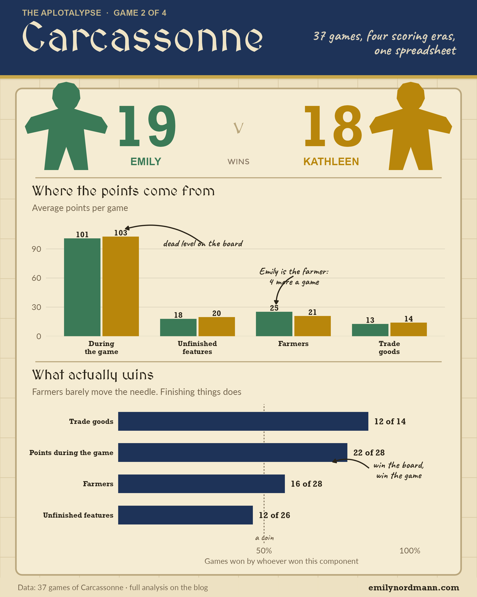

*This blog was written using Claude Fable 5.1*

Second in the series of posts working through the spreadsheet of every board game Emily and her wife Kathleen have played since 2020. [Patchwork](../2026-09-11-patchwork/) went first because the scoring is simple and the data are tidy. Carcassonne is next because the scoring is not simple and the data are not tidy, and that turns out to be the interesting bit.

## The short version

{fig-alt="Infographic summarising every game of Carcassonne between Emily and Kathleen: the overall win count, Emily's record in the era when farmers were scored separately, Kathleen's biggest winning margin, how often the player who scores more on the board during play wins the game, and a bar chart of every game's winning margin with the four scoring eras shaded."}

## The game

[Carcassonne](https://boardgamegeek.com/boardgame/822/carcassonne) is a tile-laying game. Each turn you draw a tile showing some combination of city, road, monastery and field, add it to the growing map, and optionally place a meeple on it to claim the feature. Cities and roads score when they are completed, monasteries when surrounded, and at the end of the game any unfinished feature scores at a reduced rate. Fields are the notorious part: a farmer placed on a field scores at the end of the game for every completed city touching it, and because farmers never come back, a well-placed farmer early on can quietly win the game. Or lose it.

## The data, and why it changes

```{r setup}
library(tidyverse)
library(readxl)
library(flextable)
library(scales)
source("../_aplotalypse-infographic.R")

players <- c(Emily = "#3B7A57", Kathleen = "#B8860B")

# The workbook lives with the Patchwork post; the Carcassonne sheet is wide,
# one row per game, with K-/E- prefixed columns that were added over time
raw <- read_excel("../2026-09-11-patchwork/games.xlsx", sheet = "Carcassone") |>
  filter(!is.na(`K-points`), !is.na(`E-points`)) |>
  mutate(game = row_number())   # number by row in case the Game column has gaps

era_breaks <- c(1, 7, 10, 23)
era_labels <- c("Base", "End-game\nsplit", "Farmers\nsplit", "Expansions")

carc <- raw |>
  transmute(
    game,
    first    = factor(First, levels = names(players)),
    winner   = factor(Winner, levels = names(players)),
    e_points = `E-points`,   k_points = `K-points`,
    e_endgame = `E-endgame`, k_endgame = `K-endgame`,
    e_fields = `E-fields`,   k_fields = `K-fields`,
    e_trade  = `E-Trade`,    k_trade  = `K-Trade`,
    # before game 7 the "points" column is the whole score
    e_total  = coalesce(`E-total`, `E-points`),
    k_total  = coalesce(`K-total`, `K-points`),
    net      = e_total - k_total,          # positive = Emily won
    era      = cut(game, c(era_breaks, Inf), labels = era_labels, right = FALSE)
  )

n_games <- nrow(carc)
wins    <- carc |> count(winner) |> deframe()

# Long version for the component charts, one row per player per game
long <- carc |>
  select(game, era, winner,
         Emily_points = e_points, Kathleen_points = k_points,
         Emily_endgame = e_endgame, Kathleen_endgame = k_endgame,
         Emily_fields = e_fields, Kathleen_fields = k_fields,
         Emily_trade = e_trade, Kathleen_trade = k_trade,
         Emily_total = e_total, Kathleen_total = k_total) |>
  pivot_longer(Emily_points:Kathleen_total,
               names_to = c("player", "measure"), names_sep = "_") |>
  pivot_wider(names_from = measure, values_from = value) |>
  mutate(player = factor(player, levels = names(players)))

# Era shading shared by the timeline charts
era_bands <- carc |>
  group_by(era) |>
  summarise(start = min(game) - 0.5, end = max(game) + 0.5, .groups = "drop")
```

There are `r n_games` games in the sheet and they do not all record the same things, because over the years the two of them changed how they scored and what they played with. Reconstructing it from the columns, there are four eras:

1.  **Games 1 to 6.** Just a final score for each player.
2.  **Games 7 to 9.** Points scored during the game and points scored at the end recorded separately.
3.  **Games 10 to 22.** Farmers scored as their own column, so the end-of-game points now split into unfinished features and fields.
4.  **Games 23 onwards.** Expansions, which bring more tiles, more points and a new column for trade goods, the bonus for collecting the most wine, grain and cloth from completed cities.

The upshot is that the scores are not comparable across eras. The sheet also spells the game "Carcassone" throughout, which is being left alone as a historical artefact.

```{r theme}
#| code-summary: "Show theme"
theme_patch <- function(base_size = 15) {
  theme_minimal(base_size = base_size) +
    theme(
      text             = element_text(colour = "#2B2B2B"),
      plot.title       = element_text(face = "bold", size = rel(1.45),
                                      lineheight = 1.05, margin = margin(b = 4)),
      plot.title.position = "plot",
      plot.subtitle    = element_text(size = rel(0.95), colour = "#5C5C5C",
                                      lineheight = 1.1, margin = margin(b = 16)),
      plot.caption     = element_text(size = rel(0.7), colour = "#8A8A8A",
                                      hjust = 0, margin = margin(t = 18)),
      plot.caption.position = "plot",
      axis.title       = element_text(size = rel(0.8), colour = "#5C5C5C"),
      axis.title.x     = element_text(margin = margin(t = 8)),
      axis.title.y     = element_text(margin = margin(r = 8)),
      axis.text        = element_text(colour = "#2B2B2B"),
      panel.grid.minor = element_blank(),
      panel.grid.major = element_line(colour = "#EDEDED", linewidth = 0.4),
      strip.text       = element_text(face = "bold", hjust = 0, size = rel(0.95)),
      legend.position  = "top",
      legend.justification = "left",
      legend.title     = element_blank(),
      legend.text      = element_text(size = rel(0.9)),
      plot.margin      = margin(22, 26, 18, 22),
      plot.background  = element_rect(fill = "#FCFCFA", colour = NA),
      panel.background = element_rect(fill = "#FCFCFA", colour = NA)
    )
}

carc_cap <- paste0("Data: ", n_games, " games of Carcassonne, logged by hand since 2020")

# Alternating grey bands marking the four scoring eras
era_layer <- function(label_y, fills = c("#FCFCFA", "#EFEFEA"), size = 3.2) {
  list(
    geom_rect(data = era_bands,
              aes(xmin = start, xmax = end, ymin = -Inf, ymax = Inf),
              fill = rep(fills, length.out = nrow(era_bands)),
              inherit.aes = FALSE),
    geom_text(data = era_bands, aes(x = (start + end) / 2, y = label_y, label = era),
              inherit.aes = FALSE, size = size, colour = "#5C5C5C", lineheight = 0.9,
              vjust = 1)
  )
}
```

```{r infographic}
#| include: false
# The social-media poster shown at the top of the post, drawn on a 1080 x 1350
# canvas in the game's own colours, lettering and imagery (saved at 2x)
navy <- "#1E3358"; parchment <- "#EDE1C2"; ink <- "#2A2418"; muted <- "#6E5F48"
grid <- expand.grid(x = seq(0, poster_w, by = 90), y = seq(0, poster_h, by = 90))
b <- carc |> filter(game >= 10)

# Where the points come from, games 10 onwards (trade goods only exist from game 23)
comp <- long |> filter(game >= 10) |> group_by(player) |>
  summarise(`During\nthe game` = mean(points), `Unfinished\nfeatures` = mean(endgame), Farmers = mean(fields),
            `Trade\ngoods` = mean(trade, na.rm = TRUE), .groups = "drop") |>
  pivot_longer(-player, names_to = "source", values_to = "value") |>
  mutate(source = fct_inorder(source), pos = as.numeric(source) + if_else(player == "Emily", -0.2, 0.2))
farm <- comp |> filter(source == "Farmers"); board <- comp |> filter(str_detect(source, "During"))
chart1 <- ggplot(comp, aes(pos, value, fill = player)) +
  geom_col(width = 0.38) +
  geom_text(aes(label = round(value), y = value + 4), family = "Rockwell", fontface = "bold", size = 4.6, colour = ink) +
  draw_callout("dead level on the board", x = 2.05, y = 96, xend = 1.25, yend = board$value[board$player == "Kathleen"] + 8,
               colour = ink, curvature = 0.25, size = 5.8, hjust = 0.5) +
  draw_callout(paste0("Emily is the farmer:\n", round(farm$value[farm$player == "Emily"] - farm$value[farm$player == "Kathleen"]), " more a game"),
               x = 3.0, y = 62, xend = 2.82, yend = farm$value[farm$player == "Emily"] + 8,
               colour = ink, curvature = 0.3, size = 5.8, hjust = 0.5) +
  scale_fill_manual(values = players) +
  scale_x_continuous(breaks = 1:4, labels = levels(comp$source)) +
  scale_y_continuous(expand = expansion(mult = c(0, 0.08))) +
  labs(x = NULL, y = NULL, title = "Where the points come from",
       subtitle = "Average points per game") +
  theme_poster_chart(title_font = "MedievalSharp", ink = ink, muted = muted) +
  theme(axis.text.x = element_text(family = "Rockwell", face = "bold", colour = ink, size = 12, lineheight = 0.9))

# What actually wins: how often the player who won each component won the game
cw <- b |>
  transmute(game, winner, `Points during the game` = sign(e_points - k_points), `Unfinished features` = sign(e_endgame - k_endgame),
            Farmers = sign(e_fields - k_fields), `Trade goods` = sign(e_trade - k_trade)) |>
  pivot_longer(-c(game, winner), names_to = "component", values_to = "s") |> filter(!is.na(s), s != 0) |>
  mutate(agree = if_else(s > 0, "Emily", "Kathleen") == winner) |>
  group_by(component) |> summarise(n = n(), agree = sum(agree), pct = agree / n, .groups = "drop") |>
  mutate(label = paste0(agree, " of ", n), component = fct_reorder(component, pct))
top <- cw |> filter(component == "Points during the game")
chart2 <- ggplot(cw, aes(pct, component)) +
  geom_vline(xintercept = 0.5, colour = muted, linetype = "22", linewidth = 0.6) +
  geom_col(width = 0.6, fill = navy) +
  geom_text(aes(label = label, x = pct + 0.02), hjust = 0, family = "Rockwell", fontface = "bold", size = 5, colour = ink) +
  draw_callout("win the board,\nwin the game", x = 0.86, y = as.numeric(top$component) - 0.5, xend = top$pct - 0.05, yend = as.numeric(top$component) - 0.3,
               colour = ink, curvature = 0.3, size = 5.8, hjust = 0.5, label_gap = c(0.1, -0.05)) +
  annotate("text", x = 0.5, y = 0.3, label = "a coin", family = "Caveat", size = 5.2, colour = muted, hjust = 0.5) +
  scale_x_continuous(labels = percent, limits = c(0, 1.12), breaks = c(0.5, 1), expand = expansion(mult = 0)) +
  scale_y_discrete(expand = expansion(add = c(0.9, 0.55))) +
  labs(x = "Games won by whoever won this component", y = NULL, title = "What actually wins",
       subtitle = "Farmers barely move the needle. Finishing things does") +
  theme_poster_chart(title_font = "MedievalSharp", ink = ink, muted = muted) +
  theme(panel.grid.major.y = element_blank(), axis.text.y = element_text(family = "Rockwell", face = "bold", colour = ink, size = 12))

me <- shape_meeple(150, 1060, 210); mk <- shape_meeple(930, 1060, 210)
p <- poster_canvas(parchment) +
  geom_vline(data = grid, aes(xintercept = x), colour = "#DACBA6", linewidth = 0.5) +
  geom_hline(data = grid, aes(yintercept = y), colour = "#DACBA6", linewidth = 0.5) +
  annotate("rect", xmin = 0, xmax = poster_w, ymin = 1180, ymax = poster_h, fill = navy) +
  annotate("rect", xmin = 0, xmax = poster_w, ymin = 1172, ymax = 1180, fill = "#C9A84C") +
  annotate("text", x = 50, y = 1328, label = "THE APLOTALYPSE  ·  GAME 2 OF 4", family = "Montserrat", fontface = "bold",
           size = 4.8, colour = "#C9B98A", hjust = 0, vjust = 1) +
  annotate("text", x = 46, y = 1268, label = "Carcassonne", family = "MedievalSharp", size = 24, colour = "#EFE4C6", hjust = 0, vjust = 0.5) +
  annotate("text", x = 1030, y = 1255, label = paste0(n_games, " games, four scoring eras,\none spreadsheet"),
           family = "Caveat", size = 8.5, colour = "#DCD3BC", hjust = 1, vjust = 0.5, lineheight = 0.8) +
  draw_card(36, 50, 1044, 1150, fill = "#F5ECD3", border = "#B9A67C", r = 14, lwd = 1.2) +
  annotate("polygon", x = me$x, y = me$y, fill = players[["Emily"]], colour = NA) +
  annotate("polygon", x = mk$x, y = mk$y, fill = players[["Kathleen"]], colour = NA) +
  annotate("text", x = 330, y = 1065, label = wins[["Emily"]], family = "Rockwell", fontface = "bold", size = 34, colour = players[["Emily"]]) +
  annotate("text", x = 750, y = 1065, label = wins[["Kathleen"]], family = "Rockwell", fontface = "bold", size = 34, colour = players[["Kathleen"]]) +
  annotate("text", x = 540, y = 1065, label = "v", family = "MedievalSharp", size = 12, colour = "#B9A67C") +
  annotate("text", x = 330, y = 985, label = "EMILY", family = "Montserrat", fontface = "bold", size = 6, colour = players[["Emily"]]) +
  annotate("text", x = 750, y = 985, label = "KATHLEEN", family = "Montserrat", fontface = "bold", size = 6, colour = players[["Kathleen"]]) +
  annotate("text", x = 540, y = 985, label = "WINS", family = "Montserrat", size = 4.5, colour = "#8A7A66") +
  annotate("segment", x = 80, xend = 1000, y = 948, yend = 948, colour = "#B9A67C", linewidth = 0.8) +
  poster_inset(chart1, 56, 540, 1024, 942) +
  annotate("segment", x = 80, xend = 1000, y = 532, yend = 532, colour = "#B9A67C", linewidth = 0.8) +
  poster_inset(chart2, 56, 66, 1024, 526) +
  annotate("rect", xmin = 0, xmax = poster_w, ymin = 0, ymax = 44, fill = parchment, alpha = 0.95) +
  annotate("text", x = 40, y = 22, label = paste0("Data: ", n_games, " games of Carcassonne · full analysis on the blog"),
           family = "Lato", size = 4.4, colour = muted, hjust = 0, vjust = 0.5) +
  annotate("text", x = 1040, y = 22, label = "emilynordmann.com", family = "Rockwell", fontface = "bold", size = 5, colour = ink, hjust = 1, vjust = 0.5)
poster_save(p, "carcassonne-infographic.png", bg = parchment)
```

```{r data-preview}
carc |>
  select(game, era, first, e_points, e_endgame, e_fields, e_trade, e_total,
         k_points, k_endgame, k_fields, k_trade, k_total, winner) |>
  slice(c(1, 8, 12, 25)) |>
  mutate(era = str_replace_all(as.character(era), "\n", " ")) |>
  flextable() |>
  set_header_labels(game = "Game", era = "Era", first = "First",
                    e_points = "E game", e_endgame = "E end", e_fields = "E fields",
                    e_trade = "E trade", e_total = "E total",
                    k_points = "K game", k_endgame = "K end", k_fields = "K fields",
                    k_trade = "K trade", k_total = "K total", winner = "Winner") |>
  fontsize(size = 10, part = "all") |>
  autofit()
```

## Who wins?

The headline is `r wins["Emily"]` to `r wins["Kathleen"]` to Emily, which, as with Patchwork, is the kind of lead a coin produces all the time. The headline is also misleading, because the record swings wildly by era.

```{r era-table}
carc |>
  group_by(Era = era) |>
  summarise(Games = n(),
            `Emily won` = sum(winner == "Emily"),
            `Kathleen won` = sum(winner == "Kathleen"),
            `Mean score` = round(mean(c(e_total, k_total))),
            .groups = "drop") |>
  mutate(Era = str_replace_all(as.character(Era), "\n", " ")) |>
  flextable() |>
  autofit()
```

In the base game, Kathleen had the better of it. Once farmers were scored separately, Emily won `r sum(carc$era == "Farmers
split" & carc$winner == "Emily")` of `r sum(carc$era == "Farmers
split")`, including five in a row. Then the expansions arrived and Kathleen has taken `r sum(carc$era == "Expansions" & carc$winner == "Kathleen")` of the `r sum(carc$era == "Expansions")` games since, including the last `r with(rle(as.character(carc$winner)), lengths[length(lengths)])` in a row. There are two competing explanations. The one Emily prefers is that she is a farmer at heart and the farmers era rewarded that, while the expansions add so many other ways to score that her one edge got diluted. The other is that thirteen games is not many and she got lucky. The rest of this post is an attempt to tell those apart.

## Every game

The two charts below put all the games in order, with the four eras shaded. The first shows both scores. Note how the totals roughly triple across the eras: the expansions add tiles, and more tiles mean more points, which is why you cannot compare a 60-point game from 2020 with a 200-point one from later.

```{r totals}
#| fig-width: 8
#| fig-height: 5.5
#| fig-alt: "Line chart of each player's total score in every game of Carcassonne, in order played, with the four scoring eras shaded. Scores rise from around 60 in the base game to around 175 with expansions. The two lines cross constantly; the highest-scoring game is game 24, which Kathleen won 258 to 249."
totals <- long |> select(game, player, total)
peak <- carc |> slice_max(e_total + k_total, n = 1)

ggplot(totals, aes(game, total, colour = player)) +
  era_layer(label_y = 285) +
  geom_line(linewidth = 1.1, alpha = 0.9) +
  geom_point(size = 2.2) +
  annotate("text", x = peak$game + 0.8, y = max(peak$e_total, peak$k_total) + 2,
           label = paste0(peak$k_total, " v ", peak$e_total, " (game ", peak$game, ")"),
           size = 3.4, colour = "#5C5C5C", hjust = 0) +
  scale_colour_manual(values = players) +
  scale_x_continuous(breaks = seq(0, 40, 5)) +
  scale_y_continuous(breaks = seq(0, 250, 50), limits = c(0, 290)) +
  labs(x = "Game number", y = "Final score",
       title = "Score inflation",
       subtitle = "Both players' totals per game. The steps up are scoring changes, not skill",
       caption = carc_cap) +
  theme_patch()
```

```{r margins}
#| fig-width: 8
#| fig-height: 5.5
#| fig-alt: "Bar chart of the winning margin in each game of Carcassonne in order played, with the four scoring eras shaded. Emily's wins point up and Kathleen's point down. Kathleen has the two largest margins, 85 points in game 27 and 72 in game 4. Emily's wins cluster in the farmers era in the middle."
big <- carc |> slice_max(abs(net), n = 2)

ggplot(carc, aes(game, net, fill = winner)) +
  era_layer(label_y = 78) +
  geom_hline(yintercept = 0, colour = "#8A8A8A", linewidth = 0.4) +
  geom_col(width = 0.72) +
  geom_text(data = big, aes(label = paste0(abs(net), " (game ", game, ")")),
            vjust = 1.6, size = 3.4, colour = "#2B2B2B") +
  annotate("text", x = 0.6, y = 55, label = "Emily wins", hjust = 0,
           colour = players["Emily"], fontface = "bold", size = 4) +
  annotate("text", x = n_games + 0.4, y = -60, label = "Kathleen wins", hjust = 1,
           colour = players["Kathleen"], fontface = "bold", size = 4) +
  scale_fill_manual(values = players, guide = "none") +
  scale_x_continuous(breaks = seq(0, 40, 5)) +
  scale_y_continuous(breaks = seq(-80, 80, 20), labels = abs, limits = c(-95, 80)) +
  labs(x = "Game number", y = "Winning margin (points)",
       title = "How big are the wins?",
       subtitle = "This time it's Kathleen with the blowouts",
       caption = carc_cap) +
  theme_patch()
```

```{r margin-summary}
ms <- carc |> group_by(winner) |> summarise(mean_margin = mean(abs(net)), .groups = "drop") |> deframe()
```

In Patchwork Emily's wins were the blowouts and Kathleen's were the grinds. Here it is the other way round. Kathleen's average winning margin is `r round(ms["Kathleen"])` points to Emily's `r round(ms["Emily"])`, and she owns the two biggest wins in the dataset: 85 points in game 27 and 72 in game 4, where Emily scored 27 in total, the lowest score anyone has ever recorded in this sheet and a game Emily claims not to remember. Kathleen also owns the highest score, 258 in game 24, a game in which Emily scored 249, which would have won every other game they have ever played, and lost.

## Where do the points come from?

From game 10 the sheet splits each score into points scored during the game (completed cities, roads and monasteries), points from unfinished features at the end, points from farmers, and from game 23 the trade-goods bonus. So for those `r sum(carc$game >= 10)` games it is possible to ask where each player actually gets her points.

```{r components}
#| fig-width: 8
#| fig-height: 5.5
#| fig-alt: "Dodged bar chart of the average points per game from each source, for Emily and Kathleen, in two panels: the farmers era and the expansions era. Points scored during the game are by far the largest source for both, around 100 to 120. Emily averages more from farmers in both eras; Kathleen slightly more from unfinished features and trade goods."
components <- long |>
  filter(game >= 10) |>
  group_by(era, player) |>
  summarise(`During the game` = mean(points),
            `Unfinished features` = mean(endgame),
            Farmers = mean(fields),
            `Trade goods` = mean(trade),
            .groups = "drop") |>
  pivot_longer(-c(era, player), names_to = "source", values_to = "value") |>
  filter(!is.na(value)) |>
  mutate(source = fct_inorder(source),
         era = fct_relabel(era, \(x) str_replace_all(x, "\n", " ")))

ggplot(components, aes(source, value, fill = player)) +
  geom_col(position = position_dodge(width = 0.8), width = 0.72) +
  geom_text(aes(label = round(value)), position = position_dodge(width = 0.8),
            vjust = -0.5, size = 3.4, colour = "#2B2B2B") +
  facet_wrap(~era, ncol = 2, scales = "free_x") +
  scale_fill_manual(values = players) +
  scale_x_discrete(labels = label_wrap(10)) +
  scale_y_continuous(expand = expansion(mult = c(0, 0.12))) +
  labs(x = NULL, y = "Average points per game",
       title = "Where the points come from",
       subtitle = "Games 10 onwards, when the sheet records the breakdown",
       caption = carc_cap) +
  theme_patch()
```

```{r component-shares}
b <- carc |> filter(game >= 10)
share <- long |>
  filter(game >= 10) |>
  group_by(player) |>
  summarise(fields_share = sum(fields) / sum(total), .groups = "drop") |>
  deframe()
```

Two-thirds of everyone's points come from completing things during the game, and on that the two of them are dead level: `r round(mean(b$e_points))` a game for Emily, `r round(mean(b$k_points))` for Kathleen. The one place they differ is the farmers. Emily averages `r round(mean(b$e_fields - b$k_fields), 1)` more points a game from fields than Kathleen does, which is `r percent(share["Emily"], accuracy = 1)` of her total score against `r percent(share["Kathleen"], accuracy = 1)` of Kathleen's. It is a modest gap, and with 27 games it is not one to build a philosophy on. Kathleen makes a bit more back from unfinished features and trade goods, but those gaps are smaller still. So the flattering explanation survives, just: Emily really is the farmer.

## What actually wins?

Being the farmer is only useful if the farmers decide the game. For each game with a breakdown, who won each component, and how often did the person who won that component go on to win the game?

```{r component-winner}
#| fig-width: 8
#| fig-height: 4.5
#| fig-alt: "Horizontal bar chart. The player who scored more during the game won 21 of 27 games; the player with more trade goods won 12 of 14; the player with more from farmers won 16 of 27; the player with more from unfinished features won only 12 of 26."
comp <- b |>
  transmute(game, winner,
            `Points during the game` = sign(e_points - k_points),
            `Unfinished features`    = sign(e_endgame - k_endgame),
            Farmers                  = sign(e_fields - k_fields),
            `Trade goods`            = sign(e_trade - k_trade)) |>
  pivot_longer(-c(game, winner), names_to = "component", values_to = "s") |>
  filter(!is.na(s), s != 0) |>
  mutate(comp_winner = if_else(s > 0, "Emily", "Kathleen"),
         agree = comp_winner == winner) |>
  group_by(component) |>
  summarise(n = n(), agree = sum(agree), pct = agree / n, .groups = "drop") |>
  mutate(label = paste0(agree, " of ", n))

ggplot(comp, aes(pct, fct_reorder(component, pct))) +
  geom_vline(xintercept = 0.5, colour = "#8A8A8A", linetype = "dashed") +
  geom_col(width = 0.62, fill = "#4B4F58") +
  geom_text(aes(label = label), hjust = -0.15, size = 3.8, colour = "#2B2B2B") +
  scale_x_continuous(labels = percent, limits = c(0, 1.08),
                     expand = expansion(mult = c(0, 0))) +
  labs(x = "Games won by the player who won this component", y = NULL,
       title = "Win the board, win the game",
       subtitle = "Dashed line = no better than a coin. Games 10 onwards",
       caption = carc_cap) +
  theme_patch()
```

This is fairly humbling for the farmer. The player who scores more during the game wins `r comp |> filter(component == "Points during the game") |> pull(pct) |> percent(accuracy = 1)` of the time. Winning the farmers gets you to `r comp |> filter(component == "Farmers") |> pull(pct) |> percent(accuracy = 1)`, barely better than the coin. And scoring more from unfinished features is actively a bad sign: the player who does it wins less than half the time, because a big end-game haul mostly means you spent the game starting cities you never finished.

The trade goods are the small-sample surprise. The player who collected more of them won 12 of the 14 expansion-era games. Trade goods themselves are unlikely to swing 200-point games with a 10- or 20-point bonus; more likely, collecting goods means you were the one completing the big cities, which is the thing that actually wins. Either way, it's a decent proxy and it is the component Kathleen has been quietly winning.

```{r win-loss}
wl <- b |>
  mutate(result = if_else(winner == "Emily", "Emily wins", "Kathleen wins")) |>
  group_by(result) |>
  summarise(e_points = mean(e_points), k_points = mean(k_points),
            e_fields = mean(e_fields), k_fields = mean(k_fields), .groups = "drop")
```

Put the two findings together and you get the shape of their games. When Emily wins, it is close on the board (she averages `r round(wl$e_points[wl$result == "Emily wins"])` in-game points to Kathleen's `r round(wl$k_points[wl$result == "Emily wins"])`) and her farmers do the rest (`r round(wl$e_fields[wl$result == "Emily wins"])` to `r round(wl$k_fields[wl$result == "Emily wins"])`). When Kathleen wins, she has simply out-built Emily: `r round(wl$k_points[wl$result == "Kathleen wins"])` to `r round(wl$e_points[wl$result == "Kathleen wins"])` on the board, and the farmers are level. Emily's route to victory is narrow and Kathleen's is wide, which is a good description of the margins chart too.

## Going first

```{r first}
carc |>
  count(first, winner) |>
  group_by(first) |>
  mutate(pct = percent(n / sum(n), accuracy = 1)) |>
  ungroup() |>
  mutate(cell = paste0(n, " (", pct, ")")) |>
  select(first, winner, cell) |>
  pivot_wider(names_from = winner, values_from = cell) |>
  rename(`Went first` = first, `Emily won` = Emily, `Kathleen won` = Kathleen) |>
  flextable() |>
  autofit()
```

For the record, the player who goes first has won `r sum(carc$first == carc$winner)` of `r n_games` games, so if anything you want to go second, and Kathleen has gone first `r sum(carc$first == "Kathleen")` times to Emily's `r sum(carc$first == "Emily")`. As with Patchwork, the sheet does not say why.

## Verdict

Carcassonne is the game where the spreadsheet most needs a health warning: four scoring regimes, scores that triple over time, and a headline record that hides an era in which Emily was very good and another in which she has been losing. On the substance, Emily is the farmer and Kathleen is the builder, and the builder's route to winning is the more reliable one. If Emily wants the expansion-era record to stop drifting Kathleen's way, the data say the answer is not better farmers. It's finishing more cities.

Next up: [7 Wonders Duel](../2026-09-11-duel/), which records not just who won but how.

::: {.callout-note collapse="true"}
## All games

```{r all-games}
carc |>
  mutate(era = str_replace_all(as.character(era), "\n", " ")) |>
  select(game, era, first, e_points, e_endgame, e_fields, e_trade, e_total,
         k_points, k_endgame, k_fields, k_trade, k_total, winner, net) |>
  flextable() |>
  set_header_labels(game = "Game", era = "Era", first = "First",
                    e_points = "E game", e_endgame = "E end", e_fields = "E fields",
                    e_trade = "E trade", e_total = "E total",
                    k_points = "K game", k_endgame = "K end", k_fields = "K fields",
                    k_trade = "K trade", k_total = "K total",
                    winner = "Winner", net = "E minus K") |>
  fontsize(size = 9, part = "all") |>
  autofit()
```
:::
