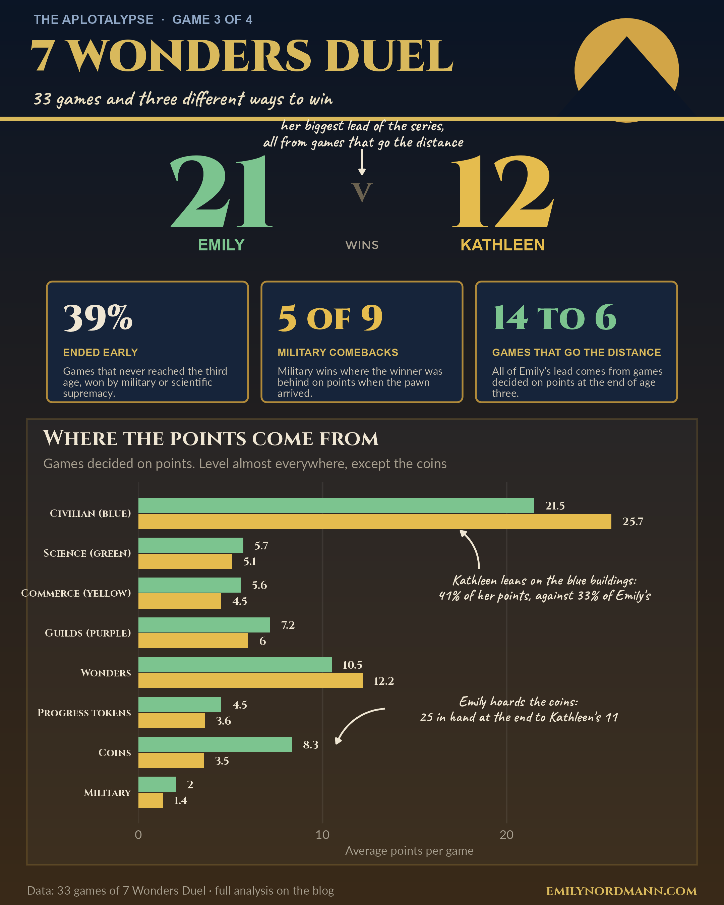

*This blog was written using Claude Fable 5.1*

Third post in the series on the spreadsheet of every board game Emily and her wife Kathleen have played since 2020, after [Patchwork](../2026-09-11-patchwork/) and [Carcassonne](../2026-09-11-carcassonne/). 7 Wonders Duel gets a post of its own for two reasons. It is the game with the most detailed scoring record, eight columns per player, and it is the only one where the sheet records not just who won but *how*, because Duel is a game you can win three different ways.

## The short version

{fig-alt="Infographic summarising every game of 7 Wonders Duel between Emily and Kathleen: the overall win count, the share of games that ended early by military or scientific supremacy, how many military wins were comebacks from behind on points, average coins in hand at the end for each player, and a tile chart showing how each game ended and who won it."}

## The game

[7 Wonders Duel](https://boardgamegeek.com/boardgame/173346/7-wonders-duel) is a two-player card-drafting game played over three ages. Cards are laid out in a pyramid and you take turns picking from the ones that are uncovered, either building them, discarding them for coins, or using them to construct one of your wonders. The cards come in colours: blue civilian buildings that are just worth points, green science, yellow commerce, red military and purple guilds. At the end of the third age you add up points from all of those plus your wonders, your progress tokens, your coins (three to a point) and your position on the military track, and the higher total wins.

Except that the game can end early. If you push the military pawn all the way into your opponent's capital, you win on the spot by military supremacy. If you collect six different scientific symbols, you win on the spot by scientific supremacy. Both of these happen far more often than a first read of the rules would suggest, and they are what make the game.

## The data

```{r setup}
library(tidyverse)
library(readxl)
library(flextable)
library(scales)
library(ggrepel)
source("../_aplotalypse-infographic.R")

players <- c(Emily = "#3B7A57", Kathleen = "#B8860B")

# The workbook lives with the Patchwork post. The Duel sheet has one row per
# game with K-/E- prefixed columns for each scoring category; the Winner
# column carries a suffix when the game ended early
raw <- read_excel("../2026-09-11-patchwork/games.xlsx", sheet = "Duel") |>
  filter(!is.na(`K-Blue`), !is.na(`E-Blue`))   # empty formula rows have 0 totals

duel <- raw |>
  rename_with(\(x) x |> str_to_lower() |> str_replace("^k-", "k_") |> str_replace("^e-", "e_")) |>
  rename(k_total = kathleen, e_total = emily, winner_raw = winner) |>
  mutate(
    # one game has no winner recorded; the totals settle it
    winner_raw = if_else(is.na(winner_raw),
                         if_else(e_total > k_total, "Emily", "Kathleen"), winner_raw),
    winner = factor(str_remove(winner_raw, "-.*"), levels = names(players)),
    how = case_when(str_detect(winner_raw, "military") ~ "Military supremacy",
                    str_detect(winner_raw, "science")  ~ "Scientific supremacy",
                    TRUE ~ "Points") |>
      factor(levels = c("Points", "Military supremacy", "Scientific supremacy")),
    net = e_total - k_total
  )

n_games <- nrow(duel)
wins    <- duel |> count(winner) |> deframe()

cats <- c(blue = "Civilian (blue)", green = "Science (green)", yellow = "Commerce (yellow)",
          purple = "Guilds (purple)", wonders = "Wonders", science = "Progress tokens",
          money = "Coins", military = "Military")

# One row per player per game per category
long <- duel |>
  select(game, winner, how, matches("^[ek]_")) |>
  pivot_longer(matches("^[ek]_"), names_to = c("player", "cat"), names_sep = "_") |>
  mutate(player = factor(if_else(player == "e", "Emily", "Kathleen"), levels = names(players)))

points_games <- duel |> filter(how == "Points")
```

```{r theme}
#| code-summary: "Show theme"
theme_patch <- function(base_size = 15) {
  theme_minimal(base_size = base_size) +
    theme(
      text             = element_text(colour = "#2B2B2B"),
      plot.title       = element_text(face = "bold", size = rel(1.45),
                                      lineheight = 1.05, margin = margin(b = 4)),
      plot.title.position = "plot",
      plot.subtitle    = element_text(size = rel(0.95), colour = "#5C5C5C",
                                      lineheight = 1.1, margin = margin(b = 16)),
      plot.caption     = element_text(size = rel(0.7), colour = "#8A8A8A",
                                      hjust = 0, margin = margin(t = 18)),
      plot.caption.position = "plot",
      axis.title       = element_text(size = rel(0.8), colour = "#5C5C5C"),
      axis.title.x     = element_text(margin = margin(t = 8)),
      axis.title.y     = element_text(margin = margin(r = 8)),
      axis.text        = element_text(colour = "#2B2B2B"),
      panel.grid.minor = element_blank(),
      panel.grid.major = element_line(colour = "#EDEDED", linewidth = 0.4),
      strip.text       = element_text(face = "bold", hjust = 0, size = rel(0.95)),
      legend.position  = "top",
      legend.justification = "left",
      legend.title     = element_blank(),
      legend.text      = element_text(size = rel(0.9)),
      plot.margin      = margin(22, 26, 18, 22),
      plot.background  = element_rect(fill = "#FCFCFA", colour = NA),
      panel.background = element_rect(fill = "#FCFCFA", colour = NA)
    )
}

duel_cap <- paste0("Data: ", n_games, " games of 7 Wonders Duel, logged by hand since 2020")
```

```{r infographic}
#| include: false
# The social-media poster shown at the top of the post, drawn on a 1080 x 1350
# canvas in the game's own colours, lettering and imagery (saved at 2x)
light <- info_players_light
mil_info <- duel |> filter(how == "Military supremacy") |>
  mutate(behind = (winner == "Emily" & net < 0) | (winner == "Kathleen" & net > 0))
sky_top <- "#0B1526"; sky_bot <- "#3A2A18"; gold <- "#D9B95C"; paper <- "#EFE6D3"; muted <- "#A79F8F"; cardbg <- "#16243A"

# Where the points come from, games decided on points
cat_means <- long |> filter(how == "Points", cat != "total") |> group_by(player, cat) |>
  summarise(mean = mean(value), .groups = "drop") |>
  mutate(cat = factor(cats[cat], levels = rev(cats)), pos = as.numeric(cat) + if_else(player == "Emily", 0.2, -0.2))
share <- long |> filter(how == "Points") |> group_by(player, cat) |> summarise(v = sum(value), .groups = "drop") |>
  group_by(player) |> mutate(share = v / v[cat == "total"]) |> ungroup()
coins <- cat_means |> filter(cat == "Coins"); blue <- cat_means |> filter(cat == "Civilian (blue)")
blue_share <- share |> filter(cat == "blue")
chart <- ggplot(cat_means, aes(mean, pos, fill = player)) +
  geom_col(width = 0.38, orientation = "y") +
  geom_text(aes(label = round(mean, 1), x = mean + 0.6), hjust = 0, family = "Cinzel", size = 4.2, colour = paper) +
  draw_callout(paste0("Emily hoards the coins:\n", round(3 * coins$mean[coins$player == "Emily"]), " in hand at the end to Kathleen's ",
                      round(3 * coins$mean[coins$player == "Kathleen"])),
               x = 13.4, y = 3.1, xend = coins$mean[coins$player == "Emily"] + 2.4, yend = coins$pos[coins$player == "Emily"] + 0.02,
               colour = paper, curvature = 0.3, size = 5.6, hjust = 0.5, lineheight = 0.85, label_gap = c(7.2, 0)) +
  draw_callout(paste0("Kathleen leans on the blue buildings:\n", percent(blue_share$share[blue_share$player == "Kathleen"], accuracy = 1),
                      " of her points, against ", percent(blue_share$share[blue_share$player == "Emily"], accuracy = 1), " of Emily's"),
               x = 18.5, y = 6.6, xend = 17.5, yend = blue$pos[blue$player == "Kathleen"] - 0.24,
               colour = paper, curvature = 0.25, size = 5.6, hjust = 0.5, lineheight = 0.85, label_gap = c(3.5, -0.45)) +
  scale_fill_manual(values = light) +
  scale_y_continuous(breaks = 1:8, labels = levels(cat_means$cat)) +
  scale_x_continuous(expand = expansion(mult = c(0, 0.12))) +
  labs(x = "Average points per game", y = NULL, title = "Where the points come from",
       subtitle = "Games decided on points. Level almost everywhere, except the coins") +
  theme_poster_chart(title_font = "Cinzel", ink = paper, muted = muted, grid = "#FFFFFF10") +
  theme(panel.grid.major.y = element_blank(), panel.grid.major.x = element_line(colour = "#FFFFFF12"),
        axis.text.y = element_text(family = "Cinzel", colour = paper, size = 11))

sun <- shape_circle(935, 1245, 78); pyr <- data.frame(x = c(830, 935, 1040), y = c(1176, 1296, 1176))
tile_x <- list(c(70, 370), c(390, 690), c(710, 1010))
tiles <- list(
  list(n = percent(mean(duel$how != "Points"), accuracy = 1), col = paper,
       h = "Ended early", t = "Games that never reached the third age, won by military or scientific supremacy."),
  list(n = paste0(sum(mil_info$behind), " of ", nrow(mil_info)), col = light[["Kathleen"]],
       h = "Military comebacks", t = "Military wins where the winner was behind on points when the pawn arrived."),
  list(n = paste0(sum(points_games$winner == "Emily"), " to ", sum(points_games$winner == "Kathleen")), col = light[["Emily"]],
       h = "Games that go the distance", t = "All of Emily's lead comes from games decided on points at the end of age three."))
tile_layers <- unlist(lapply(1:3, function(i) {
  x0 <- tile_x[[i]][1]; x1 <- tile_x[[i]][2]; y0 <- 750; y1 <- 930
  c(draw_card(x0, y0, x1, y1, fill = cardbg, border = "#B08A3A", r = 8, lwd = 0.9),
    list(annotate("text", x = x0 + 24, y = y1 - 34, label = tiles[[i]]$n, family = "Cinzel Black", size = 13,
                  colour = tiles[[i]]$col, hjust = 0, vjust = 1),
         annotate("text", x = x0 + 24, y = y1 - 100, label = toupper(tiles[[i]]$h), family = "Montserrat",
                  fontface = "bold", size = 4, colour = gold, hjust = 0, vjust = 1),
         geom_textbox(aes(x = x0 + 24, y = y1 - 128, label = tiles[[i]]$t), hjust = 0, vjust = 1, halign = 0,
                      width = unit(0.245, "npc"), box.colour = NA, fill = NA, family = "Lato", size = 4,
                      colour = "#CFC6B4", lineheight = 1.05, box.padding = unit(0, "pt"))))
}), recursive = FALSE)

p <- poster_canvas(sky_top) +
  draw_gradient(sky_top, sky_bot) +
  annotate("polygon", x = sun$x, y = sun$y, fill = "#E8B54A", alpha = 0.9, colour = NA) +
  annotate("polygon", x = pyr$x, y = pyr$y, fill = "#0B1526", colour = NA) +
  annotate("rect", xmin = 0, xmax = poster_w, ymin = 1170, ymax = 1176, fill = gold) +
  annotate("text", x = 50, y = 1328, label = "THE APLOTALYPSE  ·  GAME 3 OF 4", family = "Montserrat", fontface = "bold",
           size = 4.8, colour = "#8FA6C4", hjust = 0, vjust = 1) +
  annotate("text", x = 46, y = 1268, label = "7 WONDERS DUEL", family = "Cinzel Black", size = 16.5, colour = gold, hjust = 0, vjust = 0.5) +
  annotate("text", x = 46, y = 1205, label = paste0(n_games, " games and three different ways to win"),
           family = "Caveat", size = 8, colour = "#E8DDBF", hjust = 0, vjust = 0.5) +
  annotate("text", x = 330, y = 1065, label = wins[["Emily"]], family = "Cinzel Black", size = 38, colour = light[["Emily"]]) +
  annotate("text", x = 750, y = 1065, label = wins[["Kathleen"]], family = "Cinzel Black", size = 38, colour = light[["Kathleen"]]) +
  annotate("text", x = 540, y = 1065, label = "v", family = "Cinzel", size = 12, colour = "#6B6250") +
  annotate("text", x = 330, y = 985, label = "EMILY", family = "Montserrat", fontface = "bold", size = 6, colour = light[["Emily"]]) +
  annotate("text", x = 750, y = 985, label = "KATHLEEN", family = "Montserrat", fontface = "bold", size = 6, colour = light[["Kathleen"]]) +
  annotate("text", x = 540, y = 985, label = "WINS", family = "Montserrat", size = 4.5, colour = muted) +
  draw_callout("her biggest lead of the series,\nall from games that go the distance", x = 540, y = 1128, xend = 540, yend = 1090,
               colour = paper, curvature = 0, size = 6.2, hjust = 0.5, label_gap = c(0, 24)) +
  tile_layers +
  annotate("rect", xmin = 40, xmax = 1040, ymin = 60, ymax = 725, fill = "#FFFFFF08", colour = "#B08A3A40", linewidth = 0.8) +
  poster_inset(chart, 48, 66, 1032, 720) +
  annotate("text", x = 40, y = 22, label = paste0("Data: ", n_games, " games of 7 Wonders Duel · full analysis on the blog"),
           family = "Lato", size = 4.4, colour = muted, hjust = 0, vjust = 0.5) +
  annotate("text", x = 1040, y = 22, label = "emilynordmann.com", family = "Cinzel", size = 5, colour = gold, hjust = 1, vjust = 0.5)
poster_save(p, "duel-infographic.png", bg = sky_top)
```

There are `r n_games` games. For each one the sheet records both players' points in each of the eight scoring categories, the totals, and the winner, with a note if the game ended by military or scientific supremacy. One game has no winner written down; the totals say Kathleen by one point, so it is counted as hers. One thing to bear in mind throughout: when a game ended early, they still totted up the points as they stood, so the scores for those games are what the board looked like at the moment it ended, not what a finished game would have produced.

```{r data-preview}
duel |>
  select(game, e_blue, e_green, e_yellow, e_purple, e_wonders, e_science, e_money, e_military,
         e_total, k_total, winner_raw) |>
  slice(c(1, 5, 6, 12)) |>
  flextable() |>
  set_header_labels(game = "Game", e_blue = "E blue", e_green = "E green",
                    e_yellow = "E yellow", e_purple = "E purple", e_wonders = "E wonders",
                    e_science = "E tokens", e_money = "E coins", e_military = "E military",
                    e_total = "E total", k_total = "K total", winner_raw = "Winner") |>
  fontsize(size = 10, part = "all") |>
  add_footer_lines("Kathleen's category columns omitted for width.") |>
  autofit()
```

## Who wins, and how

```{r how-table}
duel |>
  count(how, winner) |>
  pivot_wider(names_from = winner, values_from = n, values_fill = 0) |>
  mutate(Total = Emily + Kathleen) |>
  rename(`How the game ended` = how) |>
  flextable() |>
  autofit()
```

The record is `r wins["Emily"]` to `r wins["Kathleen"]` to Emily. Of the three games so far this is the one with the clearest lean, a nine-game gap, though thirty-three games is still few enough that luck could account for a good chunk of it, so call it a lean rather than a verdict.

The more interesting number is in the bottom row. `r sum(duel$how != "Points")` of `r n_games` games, `r percent(mean(duel$how != "Points"), accuracy = 1)`, never reached the end of the third age. That is a lot of early finishes, and they are split fairly evenly: Emily has `r sum(duel$how == "Military supremacy" & duel$winner == "Emily")` military wins to Kathleen's `r sum(duel$how == "Military supremacy" & duel$winner == "Kathleen")`, and they have two scientific wins each. Where Emily is actually ahead is the boring way. In games that go the distance she leads `r sum(points_games$winner == "Emily")` to `r sum(points_games$winner == "Kathleen")`.

```{r timeline}
#| fig-width: 8
#| fig-height: 3.8
#| fig-alt: "Tile chart with one tile per game across 33 games, in three rows for how the game ended: points, military supremacy or scientific supremacy. Tiles are coloured by the winner. Most tiles are in the points row and most of those are Emily's; the supremacy rows are more evenly split and become more frequent in later games."
ggplot(duel, aes(game, fct_rev(how), fill = winner)) +
  geom_tile(width = 0.85, height = 0.8) +
  scale_fill_manual(values = players) +
  scale_x_continuous(breaks = seq(0, 40, 5), expand = expansion(add = 0.6)) +
  labs(x = "Game number", y = NULL,
       title = "How each game ended",
       subtitle = "One tile per game, coloured by winner",
       caption = duel_cap) +
  theme_patch() +
  theme(panel.grid.major.y = element_blank())
```

There is a pattern in time here too. Early finishes have become more common: `r sum(duel$how != "Points" & duel$game <= 16)` of the first 16 games ended early, against `r sum(duel$how != "Points" & duel$game > 16)` of the last `r n_games - 16`. This is probably what learning the game looks like. New Duel players treat it as a points race and the military track as a side-show; once you have lost a game you were winning on points to a pawn arriving in your capital, you start playing the track properly, and that means more games end there.

## The games that go the distance

```{r points-stats}
pg <- points_games
ms <- pg |> group_by(winner) |> summarise(mean_margin = mean(abs(net)), .groups = "drop") |> deframe()
```

Take the `r nrow(pg)` games that were decided on points. They are close: the average margin is `r round(mean(abs(pg$net)))` points on totals of around `r round(mean(c(pg$e_total, pg$k_total)))`, and the biggest win either player has managed is `r max(abs(pg$net))`. Compare Carcassonne, where 85-point blowouts happen. Duel is a game of small edges, so the question is where the edges come from.

```{r categories}
#| fig-width: 8
#| fig-height: 6
#| fig-alt: "Dodged horizontal bar chart of average points per game in each of eight scoring categories for Emily and Kathleen, points-decided games only. Civilian buildings are the largest category for both, around 22 for Emily and 26 for Kathleen. Wonders are next. Emily's coins average about 8 to Kathleen's 4; the other categories are close."
cat_means <- long |>
  filter(how == "Points", cat != "total") |>
  group_by(player, cat) |>
  summarise(mean = mean(value), .groups = "drop") |>
  mutate(cat = factor(cats[cat], levels = rev(cats)))

ggplot(cat_means, aes(mean, cat, fill = player)) +
  geom_col(position = position_dodge(width = 0.8), width = 0.72) +
  geom_text(aes(label = round(mean, 1)), position = position_dodge(width = 0.8),
            hjust = -0.25, size = 3.4, colour = "#2B2B2B") +
  scale_fill_manual(values = players) +
  scale_x_continuous(expand = expansion(mult = c(0, 0.1))) +
  labs(x = "Average points per game", y = NULL,
       title = "Where the points come from",
       subtitle = "Games decided on points only",
       caption = duel_cap) +
  theme_patch()
```

```{r cat-shares}
share <- long |>
  filter(how == "Points", cat %in% c("blue", "money")) |>
  group_by(player, cat) |>
  summarise(pts = sum(value), .groups = "drop") |>
  left_join(long |> filter(how == "Points", cat == "total") |>
              group_by(player) |> summarise(total = sum(value), .groups = "drop"),
            by = "player") |>
  mutate(share = pts / total)
```

Civilian buildings are the biggest single source for both players, and Kathleen leans on them harder: `r percent(share$share[share$player == "Kathleen" & share$cat == "blue"], accuracy = 1)` of her points come from blue cards against `r percent(share$share[share$player == "Emily" & share$cat == "blue"], accuracy = 1)` of Emily's, and she also gets a bit more from wonders. Across most of the categories, though, the two of them are within a point or two of each other.

The one exception is coins. Emily finishes with `r round(mean(pg$e_money), 1)` points from coins to Kathleen's `r round(mean(pg$k_money), 1)`, which at three coins a point means she ends the game sitting on about `r round(3 * mean(pg$e_money))` coins to Kathleen's `r round(3 * mean(pg$k_money))`. It is the only category where the gap is bigger than the game-to-game noise, and it shows up in nearly every game. Anyone who read the Patchwork post will recognise this. Emily is the person who hoards the currency, in every game, whether or not it is a good idea. In Duel it is a mildly good idea, since coins are points, but a coin unspent is also a card not built.

## Is there a lever?

In Carcassonne, one thing decided the game: whoever scored more on the board during play won nearly 80% of the time. The same test applied here. For each points-decided game and each category, who scored more in that category, and did they go on to win?

```{r lever}
#| fig-width: 8
#| fig-height: 5
#| fig-alt: "Horizontal bar chart of eight scoring categories showing how often the player who won that category won the game. All eight bars sit between about 40% and 65%, close to the dashed 50% line; military and civilian buildings are highest at 11 of 17 and 11 of 20, wonders lowest at 8 of 19."
lever <- long |>
  filter(how == "Points", cat != "total") |>
  select(game, winner, player, cat, value) |>
  pivot_wider(names_from = player, values_from = value) |>
  mutate(s = sign(Emily - Kathleen)) |>
  filter(s != 0) |>
  mutate(agree = if_else(s > 0, "Emily", "Kathleen") == winner) |>
  group_by(cat) |>
  summarise(n = n(), agree = sum(agree), pct = agree / n, .groups = "drop") |>
  mutate(label = paste0(agree, " of ", n), cat = cats[cat])

ggplot(lever, aes(pct, fct_reorder(cat, pct))) +
  geom_vline(xintercept = 0.5, colour = "#8A8A8A", linetype = "dashed") +
  geom_col(width = 0.62, fill = "#4B4F58") +
  geom_text(aes(label = label), hjust = -0.15, size = 3.8, colour = "#2B2B2B") +
  scale_x_continuous(labels = percent, limits = c(0, 1.08), expand = expansion(mult = 0)) +
  labs(x = "Games won by the player who won this category", y = NULL,
       title = "No single lever",
       subtitle = "Dashed line = a coin. Games decided on points only",
       caption = duel_cap) +
  theme_patch()
```

Nothing. Every category sits within shouting distance of the coin, and winning the wonders is, if anything, a slightly bad sign. Duel, unlike Carcassonne, has no single lever. The points games are won by being a little better across the board, which is a more flattering thing to be able to say about a 14 to 6 record than "she builds more cities".

## The comeback route

Which leaves the early finishes, and this is where the "points at the moment the game ended" numbers earn their keep. For each game won by military supremacy, here is what the scoreboard looked like when the pawn arrived.

```{r military}
#| fig-width: 8
#| fig-height: 4.5
#| fig-alt: "Dumbbell chart of the nine games won by military supremacy. Each row is a game with two dots for the two players' points at the moment the game ended, the winner's dot larger. In five of the nine, the winner had fewer points on the board than the loser, in one they were level, and in three the winner was also ahead."
mil <- duel |>
  filter(how == "Military supremacy") |>
  mutate(behind = case_when((winner == "Emily" & net < 0) | (winner == "Kathleen" & net > 0) ~ "Winner was behind on points",
                            net == 0 ~ "Level",
                            TRUE ~ "Winner was ahead on points"),
         label = paste0("Game ", game))

mil_long <- mil |>
  select(game, label, winner, Emily = e_total, Kathleen = k_total) |>
  pivot_longer(c(Emily, Kathleen), names_to = "player", values_to = "total") |>
  mutate(player = factor(player, levels = names(players)), won = player == winner)

ggplot(mil_long, aes(total, fct_reorder(label, game), group = label)) +
  geom_line(colour = "#C9C9C4", linewidth = 1.2) +
  geom_point(aes(colour = player, size = won)) +
  geom_text(data = mil, aes(x = pmax(e_total, k_total) + 3, y = label, label = behind),
            hjust = 0, size = 3.2, colour = "#5C5C5C", inherit.aes = FALSE) +
  scale_colour_manual(values = players) +
  scale_size_manual(values = c(`TRUE` = 5, `FALSE` = 2.6), guide = "none") +
  scale_x_continuous(limits = c(0, 130), breaks = seq(0, 80, 20)) +
  labs(x = "Points on the board when the game ended (big dot = winner)", y = NULL,
       title = "Military supremacy is the comeback",
       subtitle = "The nine games ended by the pawn reaching a capital",
       caption = duel_cap) +
  theme_patch()
```

```{r behind}
n_behind <- sum(mil$behind == "Winner was behind on points")
```

In `r n_behind` of the `r nrow(mil)` military wins, the player who won was behind on points when she did it, and those totals *include* the ten points the winner gets for being at the far end of the track. Game 12 is the extreme case: Emily won by military while Kathleen had 64 points on the board to Emily's 31. If that game had gone the distance Emily would have lost by a mile. This is the thing to understand about Duel: the points race is only one of the games being played, and the person losing it has every incentive to stop playing it and start marching. Since each of them has pulled this off four or five times, both have learned the lesson, which is presumably why the early finishes are getting more common.

```{r science}
sci <- duel |>
  filter(how == "Scientific supremacy") |>
  mutate(behind = (winner == "Emily" & net < 0) | (winner == "Kathleen" & net > 0))
```

The scientific wins are a smaller sample, `r nrow(sci)` games, but they point the same way: in `r sum(sci$behind)` of them the winner was behind on points when the sixth symbol landed. Six different symbols is a long way to go, and the player who gets there is usually the one who gave up on the points race to do it.

## Verdict

Across three games the pattern is now fairly clear. Emily hoards the currency, Kathleen builds the big things, and how that shakes out depends on the game. In Patchwork it makes them even. In Carcassonne it makes Kathleen the favourite, because the big things are what wins. In Duel it makes Emily the favourite, but only in the games that reach the end, and Duel is a game that increasingly does not. If Kathleen wants to close the gap, the data say the answer is not to out-score Emily. It's to make sure the third age never arrives.

Next up: [the league table](../2026-09-11-league-table/), with every game pooled.

::: {.callout-note collapse="true"}
## All games

```{r all-games}
duel |>
  select(game, how, winner,
         e_blue, e_green, e_yellow, e_purple, e_wonders, e_science, e_money, e_military, e_total,
         k_blue, k_green, k_yellow, k_purple, k_wonders, k_science, k_money, k_military, k_total) |>
  flextable() |>
  set_header_labels(game = "Game", how = "Ended by", winner = "Winner",
                    e_blue = "E blue", e_green = "E green", e_yellow = "E yellow",
                    e_purple = "E purple", e_wonders = "E wonders", e_science = "E tokens",
                    e_money = "E coins", e_military = "E mil", e_total = "E total",
                    k_blue = "K blue", k_green = "K green", k_yellow = "K yellow",
                    k_purple = "K purple", k_wonders = "K wonders", k_science = "K tokens",
                    k_money = "K coins", k_military = "K mil", k_total = "K total") |>
  fontsize(size = 8, part = "all") |>
  autofit()
```
:::
