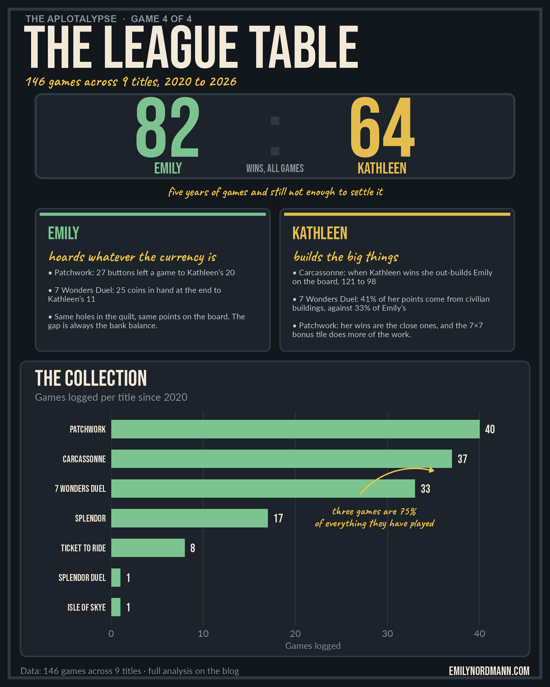

*This blog was written using Claude Fable 5.1*

The last three posts took the spreadsheet of every board game Emily and her wife Kathleen have played since 2020 one game at a time: [Patchwork](../2026-09-11-patchwork/), [Carcassonne](../2026-09-11-carcassonne/) and [7 Wonders Duel](../2026-09-11-duel/). Each of them ended with some version of "nobody can tell who's better". This post puts every sheet together to ask whether, with all the games pooled, anyone finally can, and what else falls out when you look across games rather than within them.

## The short version

{fig-alt="Infographic summarising every board game across nine titles between Emily and Kathleen: the overall win count, the number of regularly played titles in which Emily leads or is level, how often the player who goes first wins, how often the winner of the previous game wins the next one, and a dot chart of Emily's win rate in each game."}

## The collection

```{r setup}
library(tidyverse)
library(readxl)
library(flextable)
library(scales)
source("../_aplotalypse-infographic.R")

players <- c(Emily = "#3B7A57", Kathleen = "#B8860B")
f <- "../2026-09-11-patchwork/games.xlsx"

# Every sheet is laid out differently, so each gets its own tidy-up. The aim
# is one row per game with the title, order played, winner, who went first,
# both final scores and whether the game was decided on points
patch <- read_excel(f, sheet = "Patchwork") |>
  drop_na(Game, `E-buttons`, `K-buttons`, Winner, First) |>
  transmute(title = "Patchwork", n = row_number(), winner = Winner, first = First,
            e = `Emily-points`, k = `Kathleen-points`, ended = "Points")

carc <- read_excel(f, sheet = "Carcassone") |>
  filter(!is.na(`K-points`), !is.na(`E-points`)) |>
  transmute(title = "Carcassonne", n = row_number(), winner = Winner, first = First,
            e = coalesce(`E-total`, `E-points`), k = coalesce(`K-total`, `K-points`),
            ended = "Points")

duel <- read_excel(f, sheet = "Duel") |>
  filter(!is.na(`K-Blue`), !is.na(`E-Blue`)) |>   # empty formula rows have 0 totals
  mutate(Winner = if_else(is.na(Winner), if_else(Emily > Kathleen, "Emily", "Kathleen"), Winner)) |>
  transmute(title = "7 Wonders Duel", n = row_number(), winner = str_remove(Winner, "-.*"),
            first = NA_character_, e = Emily, k = Kathleen,
            ended = if_else(str_detect(Winner, "-"), "Supremacy", "Points"))

splendor <- read_excel(f, sheet = "Splendor") |>
  filter(!is.na(`K-points`), !is.na(`E-points`)) |>
  transmute(title = "Splendor", n = row_number(), winner = Winner, first = First,
            e = `E-points`, k = `K-points`, ended = "Points")

ttr <- read_excel(f, sheet = "Ticket to Ride") |>
  filter(!is.na(`E-score`)) |>
  transmute(title = "Ticket to Ride", n = row_number(), winner = Winner, first = First,
            e = `E-total`, k = `K-total`, ended = "Points")

seven <- read_excel(f, sheet = "7Wonders") |>
  filter(!is.na(`K-Military`)) |>
  transmute(title = "7 Wonders", n = row_number(), winner = Winner, first = NA_character_,
            e = Emily, k = Kathleen, ended = "Points")

splendor_duel <- read_excel(f, sheet = "Splendor Duel") |>
  filter(!is.na(`K-points`), !is.na(`E-points`)) |>   # the sheet has pre-numbered empty rows
  transmute(title = "Splendor Duel", n = row_number(), winner = Winner, first = First,
            e = `E-points`, k = `K-points`, ended = "Points")

skye <- read_excel(f, sheet = "Isle of Skye") |>
  filter(!is.na(`K-total`), !is.na(`E-total`)) |>
  transmute(title = "Isle of Skye", n = row_number(), winner = Winner, first = First,
            e = `E-total`, k = `K-total`, ended = "Points")

# The Scrabble sheet is one game recorded turn by turn; the columns sum to
# the final scores
scrabble_raw <- read_excel(f, sheet = "Scrabble")
scrabble <- tibble(title = "Scrabble", n = 1, first = NA_character_,
                   e = sum(scrabble_raw$Emily, na.rm = TRUE),
                   k = sum(scrabble_raw$Kathleen, na.rm = TRUE), ended = "Points") |>
  mutate(winner = if_else(e > k, "Emily", "Kathleen"))

all_games <- bind_rows(patch, carc, duel, splendor, ttr, seven, splendor_duel, skye, scrabble) |>
  mutate(winner = factor(winner, levels = names(players)),
         title = fct_infreq(title),
         margin_pct = abs(e - k) / pmax(e, k))

n_total <- nrow(all_games)
wins <- all_games |> count(winner) |> deframe()
```

```{r theme}
#| code-summary: "Show theme"
theme_patch <- function(base_size = 15) {
  theme_minimal(base_size = base_size) +
    theme(
      text             = element_text(colour = "#2B2B2B"),
      plot.title       = element_text(face = "bold", size = rel(1.45),
                                      lineheight = 1.05, margin = margin(b = 4)),
      plot.title.position = "plot",
      plot.subtitle    = element_text(size = rel(0.95), colour = "#5C5C5C",
                                      lineheight = 1.1, margin = margin(b = 16)),
      plot.caption     = element_text(size = rel(0.7), colour = "#8A8A8A",
                                      hjust = 0, margin = margin(t = 18)),
      plot.caption.position = "plot",
      axis.title       = element_text(size = rel(0.8), colour = "#5C5C5C"),
      axis.title.x     = element_text(margin = margin(t = 8)),
      axis.title.y     = element_text(margin = margin(r = 8)),
      axis.text        = element_text(colour = "#2B2B2B"),
      panel.grid.minor = element_blank(),
      panel.grid.major = element_line(colour = "#EDEDED", linewidth = 0.4),
      strip.text       = element_text(face = "bold", hjust = 0, size = rel(0.95)),
      legend.position  = "top",
      legend.justification = "left",
      legend.title     = element_blank(),
      legend.text      = element_text(size = rel(0.9)),
      plot.margin      = margin(22, 26, 18, 22),
      plot.background  = element_rect(fill = "#FCFCFA", colour = NA),
      panel.background = element_rect(fill = "#FCFCFA", colour = NA)
    )
}

all_cap <- paste0("Data: ", n_total, " two-player games across ",
                  n_distinct(all_games$title), " titles, logged by hand since 2020")
```

```{r league-data}
# Win rate per title for the games played at least eight times, plus the pool
league <- all_games |>
  group_by(title) |>
  summarise(games = n(), emily = sum(winner == "Emily"), .groups = "drop") |>
  bind_rows(tibble(title = "All games", games = n_total, emily = wins[["Emily"]])) |>
  filter(games >= 8) |>
  mutate(pct = emily / games,
         label = paste0(emily, " of ", games),
         is_all = title == "All games",
         title = fct_reorder(as.character(title), pct))

# Previous-game winner, for the momentum check
mo <- all_games |>
  group_by(title) |>
  arrange(n, .by_group = TRUE) |>
  mutate(prev = lag(winner)) |>
  ungroup() |>
  filter(!is.na(prev))
same <- mean(mo$winner == mo$prev)

fp <- all_games |> filter(!is.na(first))
```

```{r infographic}
#| include: false
# The social-media poster shown at the top of the post, drawn on a 1080 x 1350
# canvas in the game's own colours, lettering and imagery (saved at 2x)
light <- info_players_light
board <- "#12171C"; panel <- "#1C232A"; frame <- "#2E3944"; led <- "#F2E9D8"; muted <- "#8C949C"; accent <- "#F4C542"

# The two play styles, pulled from the individual game sheets
pw <- read_excel(f, sheet = "Patchwork") |> drop_na(Game, `E-buttons`, `K-buttons`, Winner)
dl <- read_excel(f, sheet = "Duel") |> filter(!is.na(`K-Blue`), !is.na(`E-Blue`), is.na(Winner) | !str_detect(Winner, "-"))
cc <- read_excel(f, sheet = "Carcassone") |> filter(!is.na(`K-points`), !is.na(`E-points`)) |> mutate(game = row_number()) |> filter(game >= 10)
style_e <- c(
  paste0("Patchwork: ", round(mean(pw$`E-buttons`)), " buttons left a game to Kathleen's ", round(mean(pw$`K-buttons`))),
  paste0("7 Wonders Duel: ", round(3 * mean(dl$`E-Money`)), " coins in hand at the end to Kathleen's ", round(3 * mean(dl$`K-Money`))),
  "Same holes in the quilt, same points on the board. The gap is always the bank balance.")
kw <- cc |> filter(Winner == "Kathleen")
style_k <- c(
  paste0("Carcassonne: when Kathleen wins she out-builds Emily on the board, ", round(mean(kw$`K-points`)), " to ", round(mean(kw$`E-points`))),
  paste0("7 Wonders Duel: ", percent(sum(dl$`K-Blue`) / sum(dl$Kathleen), accuracy = 1), " of her points come from civilian buildings, against ",
         percent(sum(dl$`E-Blue`) / sum(dl$Emily), accuracy = 1), " of Emily's"),
  "Patchwork: her wins are the close ones, and the 7×7 bonus tile does more of the work.")

# The collection
# The collection (the two-player games still in rotation; 7 Wonders and Scrabble left out)
counts <- all_games |> count(title, name = "games") |> mutate(title = as.character(title)) |>
  filter(!title %in% c("7 Wonders", "Scrabble")) |>
  mutate(title = fct_reorder(title, games))
big3 <- sum(all_games$title %in% c("Patchwork", "Carcassonne", "7 Wonders Duel")) / n_total
chart <- ggplot(counts, aes(games, title)) +
  geom_col(width = 0.62, fill = light[["Emily"]]) +
  geom_text(aes(label = games, x = games + 0.6), hjust = 0, family = "Bebas Neue", size = 6, colour = led) +
  draw_callout(paste0("three games are ", percent(big3, accuracy = 1), "\nof everything they have played"),
               x = 27, y = nrow(counts) - 2.2, xend = max(counts$games) - 5, yend = nrow(counts) - 1.4,
               colour = accent, curvature = -0.3, size = 5.8, hjust = 0.5, lineheight = 0.85, label_gap = c(1.5, -0.75)) +
  scale_x_continuous(expand = expansion(mult = c(0, 0.08))) +
  labs(x = "Games logged", y = NULL, title = "The collection",
       subtitle = "Games logged per title since 2020") +
  theme_poster_chart(title_font = "Bebas Neue", ink = led, muted = muted, grid = "#FFFFFF10") +
  theme(panel.grid.major.y = element_blank(), panel.grid.major.x = element_line(colour = "#FFFFFF10"),
        plot.title = element_text(size = rel(1.9), face = "plain", margin = margin(b = 4)),
        axis.text.y = element_text(family = "Bebas Neue", colour = led, size = 14))

style_card <- function(x0, x1, who, colour, heading, lines) {
  c(draw_card(x0, 660, x1, 940, fill = panel, border = frame, r = 10, lwd = 1),
    list(annotate("rect", xmin = x0 + 8, xmax = x1 - 8, ymin = 926, ymax = 932, fill = colour),
         annotate("text", x = x0 + 24, y = 905, label = toupper(who), family = "Bebas Neue", size = 9, colour = colour, hjust = 0, vjust = 1),
         annotate("text", x = x0 + 24, y = 858, label = heading, family = "Caveat", size = 7.5, colour = accent, hjust = 0, vjust = 1),
         geom_textbox(aes(x = x0 + 24, y = 820, label = paste0("• ", lines[1], "<br><br>• ", lines[2], "<br><br>• ", lines[3])),
                      hjust = 0, vjust = 1, halign = 0, width = unit((x1 - x0 - 48) / poster_w, "npc"), box.colour = NA, fill = NA,
                      family = "Lato", size = 4, colour = "#C9D0D6", lineheight = 1.1, box.padding = unit(0, "pt"))))
}

p <- poster_canvas(board) +
  annotate("rect", xmin = 18, xmax = poster_w - 18, ymin = 18, ymax = poster_h - 18, fill = NA, colour = frame, linewidth = 2) +
  annotate("text", x = 50, y = 1320, label = "THE APLOTALYPSE  ·  GAME 4 OF 4", family = "Montserrat", fontface = "bold",
           size = 4.8, colour = muted, hjust = 0, vjust = 1) +
  annotate("text", x = 46, y = 1258, label = "THE LEAGUE TABLE", family = "Bebas Neue", size = 30, colour = led, hjust = 0, vjust = 0.5) +
  annotate("text", x = 46, y = 1192, label = paste0(n_total, " games across ", n_distinct(all_games$title), " titles, 2020 to 2026"),
           family = "Caveat", size = 7.5, colour = accent, hjust = 0, vjust = 0.5) +
  draw_card(70, 1000, 1010, 1165, fill = panel, border = frame, r = 12, lwd = 1.5) +
  annotate("text", x = 330, y = 1100, label = wins[["Emily"]], family = "Bebas Neue", size = 42, colour = light[["Emily"]]) +
  annotate("text", x = 750, y = 1100, label = wins[["Kathleen"]], family = "Bebas Neue", size = 42, colour = light[["Kathleen"]]) +
  annotate("text", x = 540, y = 1100, label = ":", family = "Bebas Neue", size = 40, colour = frame) +
  annotate("text", x = 330, y = 1020, label = "EMILY", family = "Bebas Neue", size = 8, colour = light[["Emily"]]) +
  annotate("text", x = 750, y = 1020, label = "KATHLEEN", family = "Bebas Neue", size = 8, colour = light[["Kathleen"]]) +
  annotate("text", x = 540, y = 1020, label = "WINS, ALL GAMES", family = "Bebas Neue", size = 5.5, colour = muted) +
  annotate("text", x = 540, y = 975, label = "five years of games and still not enough to settle it",
           family = "Caveat", size = 6.2, colour = accent, hjust = 0.5, vjust = 0.5) +
  style_card(70, 530, "Emily", light[["Emily"]], "hoards whatever the currency is", style_e) +
  style_card(550, 1010, "Kathleen", light[["Kathleen"]], "builds the big things", style_k) +
  draw_card(40, 60, 1040, 640, fill = panel, border = frame, r = 12, lwd = 1) +
  poster_inset(chart, 52, 66, 1028, 634) +
  annotate("text", x = 40, y = 32, label = paste0("Data: ", n_total, " games across ", n_distinct(all_games$title), " titles · full analysis on the blog"),
           family = "Lato", size = 4.4, colour = muted, hjust = 0, vjust = 0.5) +
  annotate("text", x = 1040, y = 32, label = "EMILYNORDMANN.COM", family = "Bebas Neue", size = 6, colour = led, hjust = 1, vjust = 0.5)
poster_save(p, "league-table-infographic.png", bg = board)
```

The sheet has `r n_distinct(all_games$title)` tabs, one per game, and between them they give `r n_total` results.

```{r collection}
#| fig-width: 8
#| fig-height: 5
#| fig-alt: "Horizontal bar chart of how many times each game has been logged. Patchwork, Carcassonne and 7 Wonders Duel lead with well over thirty games each, Splendor has seventeen, Ticket to Ride and 7 Wonders eight each, and Isle of Skye, Splendor Duel and Scrabble one each."
counts <- all_games |>
  count(title, name = "games") |>
  mutate(title = fct_reorder(as.character(title), games))

ggplot(counts, aes(games, title)) +
  geom_col(width = 0.66, fill = "#4B4F58") +
  geom_text(aes(label = games), hjust = -0.35, size = 3.8, colour = "#2B2B2B") +
  scale_x_continuous(expand = expansion(mult = c(0, 0.1))) +
  labs(x = "Games logged", y = NULL,
       title = "The collection",
       subtitle = "Three games account for three-quarters of everything they've played",
       caption = all_cap) +
  theme_patch()
```

Three games account for `r percent(sum(all_games$title %in% c("Patchwork", "Carcassonne", "7 Wonders Duel")) / n_total, accuracy = 1)` of the record, which is why they got posts of their own. The rest is a long tail. Splendor got a decent run, Ticket to Ride and the full 7 Wonders got eight games each, and Isle of Skye, Splendor Duel and Scrabble are newer arrivals with one game each so far. The Scrabble game deserves a footnote: Emily won `r scrabble$e` to `r scrabble$k`, a margin that rests on a single `r max(scrabble_raw$Emily, na.rm = TRUE)`-point turn.

## The league table

```{r league}
#| fig-width: 8
#| fig-height: 5.5
#| fig-alt: "Dot chart of Emily's win rate in each game played at least eight times, plus all games combined, with a dashed line at 50% and each dot labelled with wins out of games. 7 Wonders Duel is highest at 64%, Ticket to Ride lowest at exactly 50%. All games combined is 57%."
ggplot(league, aes(pct, title)) +
  geom_vline(xintercept = 0.5, colour = "#8A8A8A", linetype = "dashed") +
  geom_segment(aes(x = 0.5, xend = pct, yend = title), colour = "#D9D9D3", linewidth = 1.5) +
  geom_point(aes(size = games, colour = is_all)) +
  geom_text(aes(label = label, x = pct + 0.03), hjust = 0, size = 3.4, colour = "#5C5C5C") +
  scale_colour_manual(values = c(`FALSE` = players[["Emily"]], `TRUE` = "#2B2B2B"), guide = "none") +
  scale_size_area(max_size = 9, guide = "none") +
  scale_x_continuous(labels = percent, limits = c(0.3, 0.85), breaks = seq(0.25, 0.75, 0.25)) +
  labs(x = "Emily's win rate", y = NULL,
       title = "Emily's win rate, game by game",
       subtitle = "Games played at least eight times. Dot size = number of games",
       caption = all_cap) +
  theme_patch()
```

Pooled across everything, the score is **`r wins["Emily"]` to `r wins["Kathleen"]`** to Emily, a win rate of `r percent(wins[["Emily"]] / n_total, accuracy = 1)`. And it is *still* not enough. A lead of `r wins[["Emily"]] - wins[["Kathleen"]]` games sounds like a lot, but spread over `r n_total` games it is the kind of gap two evenly matched players produce fairly often just by chance. Nearly a hundred and fifty games, five years, and the honest answer is a shrug.

What the chart does show is that the lean is consistent. Emily is ahead or level in every game they have played eight or more times. Ticket to Ride is a dead heat and 7 Wonders Duel is the strongest lean at `r percent(league$pct[league$title == "7 Wonders Duel"], accuracy = 1)`. Kathleen's only outright leads on the table are the games they played once: Isle of Skye and Splendor Duel. In the six titles they play repeatedly she leads none; in the three they played once she leads two. No conclusion will be drawn from that. It is simply being left here.

## Do they get better?

```{r halves}
#| fig-width: 8
#| fig-height: 4
#| fig-alt: "Dumbbell chart for the four games played most, showing Emily's win rate in the first half of that game's series and the second half. The changes are small and go in both directions: Patchwork rises from 50% to 60%, Carcassonne falls from 56% to 50%, Duel and Splendor barely move."
halves <- all_games |>
  filter(title %in% c("Patchwork", "Carcassonne", "7 Wonders Duel", "Splendor")) |>
  group_by(title) |>
  mutate(half = if_else(n <= max(n) / 2, "First half", "Second half")) |>
  group_by(title, half) |>
  summarise(games = n(), pct = mean(winner == "Emily"), .groups = "drop") |>
  mutate(title = fct_rev(fct_drop(title)))

ggplot(halves, aes(pct, title, group = title)) +
  geom_vline(xintercept = 0.5, colour = "#8A8A8A", linetype = "dashed") +
  geom_line(colour = "#C9C9C4", linewidth = 1.2) +
  geom_point(aes(colour = half), size = 4.5) +
  scale_colour_manual(values = c(`First half` = "#B8B8B2", `Second half` = players[["Emily"]])) +
  scale_x_continuous(labels = percent, limits = c(0.3, 0.75)) +
  labs(x = "Emily's win rate", y = NULL,
       title = "No learning curve",
       subtitle = "Emily's win rate in the first and second half of each game's history",
       caption = all_cap) +
  theme_patch()
```

One thing you might expect from five years of the same two people playing the same games is that one of them would pull away as they learned, or that the games would get closer as both did. Neither happens. Splitting each of the four main games into the first and second half of its history, Emily's win rate moves by a few games' worth in one direction or the other and that is all. Whatever the gap between them is, it was there in game 1 and it is there now.

```{r streaks}
streaks <- all_games |>
  filter(title %in% c("Patchwork", "Carcassonne", "7 Wonders Duel", "Splendor")) |>
  group_by(title) |>
  reframe({ r <- rle(as.character(winner)); tibble(player = r$values, len = r$lengths) }) |>
  group_by(player) |>
  summarise(longest = max(len), .groups = "drop") |>
  deframe()
```

There is no momentum either. Across all `r nrow(mo)` games that had a previous game of the same title, the winner of the previous game won the next one `r percent(same, accuracy = 1)` of the time, which is the coin again. Streaks happen, and Emily has the two longest, six in a row at both Patchwork and Duel against Kathleen's best of `r streaks[["Kathleen"]]`, but that is about what you would expect from `r n_total` coin flips with a slight bias, not evidence of a hot hand.

## Going first

```{r first}
first_tab <- fp |>
  group_by(title) |>
  summarise(games = n(), k_first = sum(first == "Kathleen"), first_won = sum(first == winner), .groups = "drop") |>
  filter(games >= 8) |>
  mutate(title = as.character(title)) |>
  bind_rows(fp |> summarise(title = "All games with a record", games = n(),
                            k_first = sum(first == "Kathleen"), first_won = sum(first == winner))) |>
  mutate(`Kathleen went first` = paste0(k_first, " (", percent(k_first / games, accuracy = 1), ")"),
         `First player won` = paste0(first_won, " (", percent(first_won / games, accuracy = 1), ")")) |>
  select(Game = title, Games = games, `Kathleen went first`, `First player won`)

first_tab |>
  flextable() |>
  autofit()
```

Six of the sheets record who went first, `r nrow(fp)` games in all. Two things come out of them. First, going first doesn't help: the first player won `r percent(mean(fp$first == fp$winner), accuracy = 1)` of the time. Second, Kathleen goes first a lot: `r percent(mean(fp$first == "Kathleen"), accuracy = 1)` of the time. The Patchwork post said the sheet does not say why, and it doesn't, but with all the games together the obvious theory can at least be tested.

```{r rule}
rule <- fp |>
  group_by(title) |>
  arrange(n, .by_group = TRUE) |>
  mutate(prev_loser = lag(if_else(winner == "Emily", "Kathleen", "Emily")),
         prev_first = lag(first)) |>
  ungroup() |>
  filter(!is.na(prev_loser))
loser_first <- mean(rule$first == rule$prev_loser)
alternate <- mean(rule$first != rule$prev_first)
```

The obvious theory is that the loser of the last game goes first, which, if Emily wins more, would put Kathleen in the first seat more often. It is not that: across the `r nrow(rule)` games with a previous game to compare, the previous loser went first `r percent(loser_first, accuracy = 1)` of the time. Nor do they simply alternate; the first player changed from one game to the next `r percent(alternate, accuracy = 1)` of the time. So there is no rule, or at least none the data can find. Emily has no explanation. Kathleen will presumably have one, and it will presumably be Emily's fault.

## Which game is closest?

```{r closeness}
#| fig-width: 8
#| fig-height: 5
#| fig-alt: "Dot plot of the winning margin as a percentage of the winner's score for each game decided on points, one row per title, with a bar at each median. 7 Wonders Duel is the closest with a median margin of about 12%, then Carcassonne and 7 Wonders around 14%, Ticket to Ride 17% and Splendor 25%. Patchwork is excluded."
close <- all_games |>
  filter(ended == "Points", title != "Patchwork") |>
  mutate(title = fct_drop(title)) |>
  group_by(title) |>
  filter(n() >= 8) |>
  ungroup() |>
  mutate(title = fct_reorder(title, margin_pct, .fun = median, .desc = TRUE))

ggplot(close, aes(margin_pct, title)) +
  geom_jitter(aes(colour = winner), height = 0.18, width = 0, size = 2.4, alpha = 0.7) +
  stat_summary(fun = median, geom = "crossbar", width = 0.5, linewidth = 0.7, colour = "#2B2B2B") +
  scale_colour_manual(values = players) +
  scale_x_continuous(labels = percent) +
  labs(x = "Winning margin as % of the winner's score (bar = median)", y = NULL,
       title = "Which game is closest?",
       subtitle = "Games decided on points. Patchwork is left out because its scores go negative",
       caption = all_cap) +
  theme_patch()
```

```{r close-stats}
close_med <- close |> group_by(title) |> summarise(med = median(margin_pct), .groups = "drop") |> deframe()
```

To compare margins across games with wildly different scoring, each winning margin is expressed as a percentage of the winner's score. Patchwork is left out because its scores can be negative and the percentages stop meaning anything. On this measure 7 Wonders Duel is their closest game, with a typical margin of `r percent(close_med[["7 Wonders Duel"]], accuracy = 1)`, and Splendor the most one-sided at `r percent(close_med[["Splendor"]], accuracy = 1)`, which fits a game that ends the moment someone hits fifteen points. The colours are worth a look too. In Carcassonne, the far right of the row, the biggest blowouts, is mostly gold. In Duel it is mostly green. Each of them has a game she wins ugly in.

## Verdict

After `r n_total` games, the one thing the whole spreadsheet can say with confidence is that it cannot say who is better. The lean is Emily's, it is consistent across games, and it is still within the range a fair coin produces. What it can say is that the two of them play differently in the same way everywhere: Emily hoards whatever the currency is and Kathleen builds the big things, and each game decides for itself whether that favours her, Emily or neither. There is no learning curve, no momentum, no first-player edge and no house rule for who starts. There is just a very long series of close games, which is, when you think about it, exactly what you want from the person you have chosen to play board games with for the rest of your life.

Emily would also like it noted that she is ahead.

::: {.callout-note collapse="true"}
## Every game

```{r all-table}
all_games |>
  arrange(title, n) |>
  transmute(Game = title, No = n, Winner = winner, First = first,
            `Emily` = e, `Kathleen` = k, `Ended by` = ended) |>
  flextable() |>
  fontsize(size = 9, part = "all") |>
  autofit()
```
:::
