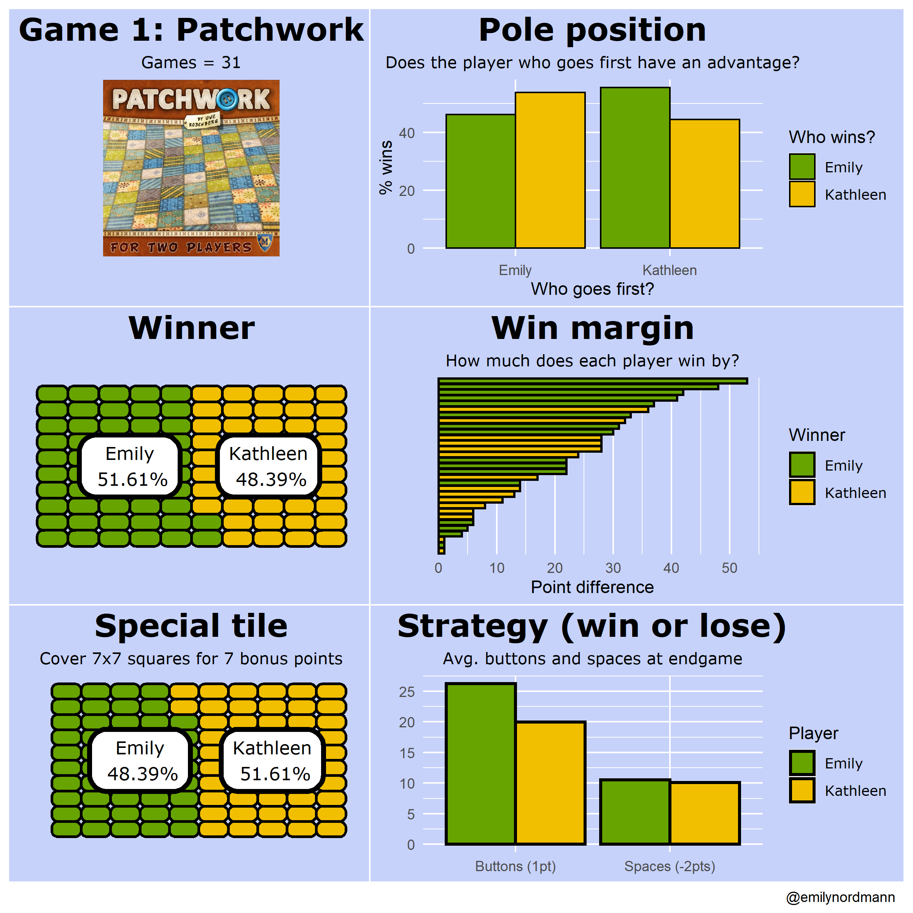
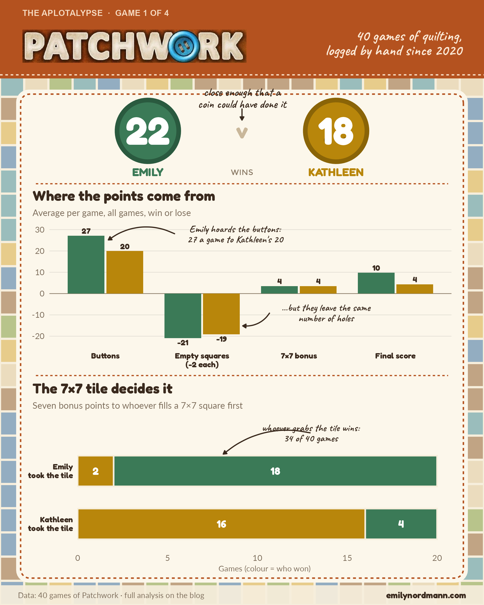

*This blog was written using Claude Fable 5.1*

In 2020, in the first lockdown, Emily Nordmann and her wife Kathleen started keeping a spreadsheet of every board game they played. This is a completely normal thing for two people to do and questions will not be taken. Because Emily is Emily, the spreadsheet did not just record who won: for each game it logged the components of the final score, so that at some point somebody could make graphs. The project was called *The Aplotalypse*, which was funny at the time, and it produced exactly one infographic per game before Emily got distracted by having to move an entire degree programme online.

{fig-alt="A six-panel infographic on a lilac background summarising 31 games of Patchwork: who goes first, who wins, win margin, the special tile, and average buttons and spaces."}

The folder resurfaced recently and, given that Emily has spent the last year [obsessively](../2025-08-31-munro-tidy-tuesday/) [charting](../2025-09-25-corbetts/) [mountains](../2026-07-12-irish-hill-names/), it seemed only right to give the games the same treatment. This is the first of four posts. Ten different games were logged, but Patchwork has the richest data and the most bitterly contested record, so it goes first.

## The short version

{fig-alt="Infographic summarising every game of Patchwork between Emily and Kathleen: the overall win count, each player's average winning margin, average buttons left per game, how often the player who takes the 7 by 7 tile wins, and a bar chart of the winning margin in every game."}

Everything below is the long version.

## The game

[Patchwork](https://boardgamegeek.com/boardgame/163412/patchwork) is a two-player game by Uwe Rosenberg in which you buy Tetris-shaped fabric patches with buttons and stitch them onto a 9×9 quilt board. Buttons are both the currency and the points. At the end, your score is:

-   **plus one point for every button you have left**,
-   **minus two points for every empty square on your board**, and
-   **plus seven points** if you were the first player to completely fill any 7×7 area, which gets you the special tile.

That's the whole game. Nearly everything interesting about how someone plays Patchwork is in those three numbers, which is why they are the three things the spreadsheet records. The tension is that the patches that earn buttons tend to be awkward shapes that leave gaps, and the patches that fill gaps neatly tend to cost buttons, so every turn is a choice between income and coverage. Negative final scores are entirely possible and, as will become clear, entirely common.

## The data

```{r setup}
library(tidyverse)
library(readxl)
library(flextable)
library(ggrepel)
library(scales)
source("../_aplotalypse-infographic.R")

# One colour per player, fixed so that Emily is always green and Kathleen
# always gold whatever order they appear in a chart
players <- c(Emily = "#3B7A57", Kathleen = "#B8860B")

# Pre-Quarto attempts stored the games in a wide sheet with one row per game
# and E-/K- prefixed columns; the trailing rows are empty formula rows
raw <- read_excel("games.xlsx", sheet = "Patchwork") |>
  drop_na(Game, `E-buttons`, `K-buttons`, `E-spaces`, `K-spaces`, Winner, First)

patch <- raw |>
  rename(game = Game, winner = Winner, first = First,
         e_buttons = `E-buttons`, k_buttons = `K-buttons`,
         e_spaces = `E-spaces`, k_spaces = `K-spaces`,
         e_special = `E-special`, k_special = `K-special`,
         e_points = `Emily-points`, k_points = `Kathleen-points`,
         margin = Difference) |>
  mutate(
    special = if_else(e_special == 7, "Emily", "Kathleen"),
    net = e_points - k_points,    # positive = Emily won
    winner = factor(winner, levels = names(players)),
    first = factor(first, levels = names(players)),
    special = factor(special, levels = names(players))
  )

# A tidy long version with one row per player per game for the
# strategy charts
long <- patch |>
  select(game, winner, first, tile = special,
         Emily_buttons = e_buttons, Kathleen_buttons = k_buttons,
         Emily_spaces = e_spaces, Kathleen_spaces = k_spaces,
         Emily_special = e_special, Kathleen_special = k_special,
         Emily_points = e_points, Kathleen_points = k_points) |>
  pivot_longer(Emily_buttons:Kathleen_points,
               names_to = c("player", "measure"), names_sep = "_") |>
  pivot_wider(names_from = measure, values_from = value) |>
  mutate(player = factor(player, levels = names(players)),
         won = winner == player)

n_games <- nrow(patch)
wins <- patch |> count(winner) |> deframe()
```

```{r theme}
#| code-summary: "Show theme"
theme_patch <- function(base_size = 15) {
  theme_minimal(base_size = base_size) +
    theme(
      text             = element_text(colour = "#2B2B2B"),
      plot.title       = element_text(face = "bold", size = rel(1.45),
                                      lineheight = 1.05, margin = margin(b = 4)),
      plot.title.position = "plot",
      plot.subtitle    = element_text(size = rel(0.95), colour = "#5C5C5C",
                                      lineheight = 1.1, margin = margin(b = 16)),
      plot.caption     = element_text(size = rel(0.7), colour = "#8A8A8A",
                                      hjust = 0, margin = margin(t = 18)),
      plot.caption.position = "plot",
      axis.title       = element_text(size = rel(0.8), colour = "#5C5C5C"),
      axis.title.x     = element_text(margin = margin(t = 8)),
      axis.title.y     = element_text(margin = margin(r = 8)),
      axis.text        = element_text(colour = "#2B2B2B"),
      panel.grid.minor = element_blank(),
      panel.grid.major = element_line(colour = "#EDEDED", linewidth = 0.4),
      strip.text       = element_text(face = "bold", hjust = 0, size = rel(0.95)),
      legend.position  = "top",
      legend.justification = "left",
      legend.title     = element_blank(),
      legend.text      = element_text(size = rel(0.9)),
      plot.margin      = margin(22, 26, 18, 22),
      plot.background  = element_rect(fill = "#FCFCFA", colour = NA),
      panel.background = element_rect(fill = "#FCFCFA", colour = NA)
    )
}

patch_cap <- paste0("Data: ", n_games, " games of Patchwork, logged by hand since 2020")
```

```{r infographic}
#| include: false
# The social-media poster shown at the top of the post, drawn on a 1080 x 1350
# canvas in the game's own colours, lettering and imagery (saved at 2x)
rust <- "#B4521F"; linen <- "#F6EEDC"; ink <- "#3A2A1E"; muted <- "#7A6A58"
fabrics <- c("#3E8C9B", "#2F6BA5", "#7A9A3A", "#D8A93A", "#E0C9A0", "#8C5A2B")
set.seed(7); cell <- 54
quilt <- expand.grid(x = seq(cell / 2, poster_w, by = cell), y = seq(cell / 2, poster_h, by = cell))
quilt$fill <- sample(fabrics, nrow(quilt), replace = TRUE)

# Where the points come from: the three parts of the score plus the result
components <- long |>
  group_by(player) |>
  summarise(Buttons = mean(buttons), `Empty squares\n(-2 each)` = -2 * mean(spaces),
            `7×7 bonus` = mean(special), `Final score` = mean(points), .groups = "drop") |>
  pivot_longer(-player, names_to = "component", values_to = "value") |>
  mutate(component = fct_inorder(component), pos = as.numeric(component) + if_else(player == "Emily", -0.2, 0.2))
btn <- components |> filter(component == "Buttons")
sq  <- components |> filter(str_detect(component, "Empty"))

chart1 <- ggplot(components, aes(pos, value, fill = player)) +
  geom_hline(yintercept = 0, colour = "#8A7A66", linewidth = 0.5) +
  geom_col(width = 0.38) +
  geom_text(aes(label = round(value), y = value + if_else(value < 0, -2.2, 2.2)), family = "Fredoka", size = 4.6, colour = ink) +
  draw_callout(paste0("Emily hoards the buttons:\n", round(btn$value[btn$player == "Emily"]), " a game to Kathleen's ",
                      round(btn$value[btn$player == "Kathleen"])),
               x = 1.72, y = 28, xend = 1.03, yend = btn$value[btn$player == "Emily"] - 2,
               colour = ink, curvature = 0.3, size = 5.8, hjust = 0.5, label_gap = c(0.62, 0)) +
  draw_callout("...but they leave the same\nnumber of holes",
               x = 2.7, y = -9, xend = 2.42, yend = sq$value[sq$player == "Kathleen"] + 4,
               colour = ink, curvature = -0.3, size = 5.8, hjust = 0.5, label_gap = c(0.58, 0)) +
  scale_fill_manual(values = players) +
  scale_x_continuous(breaks = 1:4, labels = levels(components$component)) +
  scale_y_continuous(breaks = seq(-20, 30, 10)) +
  labs(x = NULL, y = NULL, title = "Where the points come from", subtitle = "Average per game, all games, win or lose") +
  theme_poster_chart(title_font = "Fredoka", ink = ink, muted = muted) +
  theme(axis.text.x = element_text(family = "Fredoka", colour = ink, size = 13, lineheight = 0.9))

# The 7x7 tile: who took it, coloured by who won the game
tile <- patch |> count(special, winner) |> group_by(special) |> mutate(share = n / sum(n)) |> ungroup()
held <- sum(patch$special == patch$winner)
chart2 <- ggplot(tile, aes(n, fct_rev(special), fill = winner)) +
  geom_col(width = 0.58, colour = linen, linewidth = 1.2) +
  geom_text(aes(label = n), position = position_stack(vjust = 0.5), family = "Fredoka", size = 6, colour = "white") +
  draw_callout(paste0("whoever grabs the tile wins:\n", held, " of ", n_games, " games"),
               x = max(tile$n) * 0.72, y = 2.72, xend = max(tile$n) * 0.45, yend = 2.32,
               colour = ink, curvature = 0.25, size = 5.8, hjust = 0.5) +
  scale_fill_manual(values = players) +
  scale_x_continuous(expand = expansion(mult = c(0, 0.04))) +
  scale_y_discrete(labels = \(x) paste0(x, "\ntook the tile"), expand = expansion(add = c(0.5, 1.0))) +
  labs(x = "Games (colour = who won)", y = NULL, title = "The 7×7 tile decides it",
       subtitle = "Seven bonus points to whoever fills a 7×7 square first") +
  theme_poster_chart(title_font = "Fredoka", ink = ink, muted = muted) +
  theme(panel.grid.major.y = element_blank(), axis.text.y = element_text(family = "Fredoka", colour = ink, size = 13, lineheight = 0.9))

logo <- magick::image_read("patchwork-logo.png"); li <- magick::image_info(logo); lr <- li$height / li$width
p <- poster_canvas(linen) +
  geom_tile(data = quilt, aes(x, y, fill = fill), width = cell * 0.9, height = cell * 0.9, alpha = 0.5) +
  scale_fill_identity() +
  annotate("rect", xmin = 0, xmax = poster_w, ymin = 1175, ymax = poster_h, fill = rust) +
  annotate("path", x = c(0, poster_w), y = c(1183, 1183), colour = "#F6D9BF", linewidth = 1, linetype = "22") +
  annotation_raster(as.raster(logo), xmin = 50, xmax = 50 + 500, ymin = 1210, ymax = 1210 + 500 * lr) +
  annotate("text", x = 50, y = 1328, label = "THE APLOTALYPSE  ·  GAME 1 OF 4", family = "Montserrat", fontface = "bold",
           size = 4.8, colour = "#F6D9BF", hjust = 0, vjust = 1) +
  annotate("text", x = 1030, y = 1255, label = paste0(n_games, " games of quilting,\nlogged by hand since 2020"),
           family = "Caveat", size = 8.5, colour = "#FBE9D6", hjust = 1, vjust = 0.5, lineheight = 0.8) +
  draw_card(36, 50, 1044, 1150, fill = "#FCF7EB", stitch = rust, r = 28) +
  draw_button(330, 1058, 74, players[["Emily"]], "#2A5A3F") +
  draw_button(750, 1058, 74, players[["Kathleen"]], "#8A6407") +
  annotate("text", x = 330, y = 1058, label = wins[["Emily"]], family = "Fredoka", size = 22, colour = "white") +
  annotate("text", x = 750, y = 1058, label = wins[["Kathleen"]], family = "Fredoka", size = 22, colour = "white") +
  annotate("text", x = 540, y = 1058, label = "v", family = "Fredoka", size = 12, colour = "#C9B79A") +
  annotate("text", x = 330, y = 966, label = "EMILY", family = "Fredoka", size = 6.5, colour = players[["Emily"]]) +
  annotate("text", x = 750, y = 966, label = "KATHLEEN", family = "Fredoka", size = 6.5, colour = players[["Kathleen"]]) +
  annotate("text", x = 540, y = 966, label = "WINS", family = "Montserrat", size = 4.5, colour = "#8A7A66") +
  draw_callout("close enough that a\ncoin could have done it", x = 540, y = 1108, xend = 540, yend = 1082,
               colour = ink, curvature = 0, size = 6.5, hjust = 0.5, label_gap = c(0, 24)) +
  annotate("path", x = c(80, 1000), y = c(940, 940), colour = rust, linewidth = 0.9, linetype = "22") +
  poster_inset(chart1, 56, 520, 1024, 935) +
  annotate("path", x = c(80, 1000), y = c(512, 512), colour = rust, linewidth = 0.9, linetype = "22") +
  poster_inset(chart2, 56, 66, 1024, 505) +
  annotate("rect", xmin = 0, xmax = poster_w, ymin = 0, ymax = 44, fill = linen, alpha = 0.92) +
  annotate("text", x = 40, y = 22, label = paste0("Data: ", n_games, " games of Patchwork · full analysis on the blog"),
           family = "Lato", size = 4.4, colour = muted, hjust = 0, vjust = 0.5) +
  annotate("text", x = 1040, y = 22, label = "emilynordmann.com", family = "Fredoka", size = 5, colour = ink, hjust = 1, vjust = 0.5)
poster_save(p, "patchwork-infographic.png", bg = linen)
```

There are `r n_games` complete games of Patchwork in the sheet. For each one it records each player's buttons at the end, their number of empty squares, who got the special tile, who went first and who won. There are no ties. Here's what it looks like.

```{r data-preview}
patch |>
  select(game, first, e_buttons, e_spaces, e_special, e_points,
         k_buttons, k_spaces, k_special, k_points, winner) |>
  head(5) |>
  flextable() |>
  set_header_labels(game = "Game", first = "First",
                    e_buttons = "E buttons", e_spaces = "E spaces",
                    e_special = "E 7×7", e_points = "E score",
                    k_buttons = "K buttons", k_spaces = "K spaces",
                    k_special = "K 7×7", k_points = "K score",
                    winner = "Winner") |>
  autofit()
```

## Who wins?

The subtitle on the 2020 version of the "who wins" chart, before it was tidied up for the version above, was "Kathleen kicks Emily's ass". At the time this was fair. After 12 games Kathleen led 8–4, including a run of four straight wins. What happened next is the reason people keep spreadsheets.

```{r tally}
#| fig-width: 8
#| fig-height: 5.5
#| fig-alt: "Line chart of cumulative wins across all games of Patchwork. Kathleen leads from game 5 to game 15, Emily overtakes with a six-game winning streak between games 13 and 18, and the lines stay within a couple of wins of each other after that, finishing with Emily narrowly ahead."
tally <- patch |>
  mutate(Emily = cumsum(winner == "Emily"),
         Kathleen = cumsum(winner == "Kathleen")) |>
  select(game, Emily, Kathleen) |>
  pivot_longer(-game, names_to = "player", values_to = "wins") |>
  mutate(player = factor(player, levels = names(players)))

streak <- patch |>
  mutate(run = consecutive_id(winner)) |>
  group_by(run, winner) |>
  summarise(start = min(game), end = max(game), len = n(), .groups = "drop") |>
  slice_max(len, n = 1)

ends <- tally |> filter(game == n_games)

ggplot(tally, aes(game, wins, colour = player)) +
  annotate("rect", xmin = streak$start - 0.5, xmax = streak$end + 0.5,
           ymin = -Inf, ymax = Inf, fill = "#3B7A57", alpha = 0.08) +
  annotate("text", x = streak$start - 0.5, y = max(tally$wins) - 0.5,
           label = paste0(streak$winner, " wins ", streak$len, " in a row"),
           hjust = 1.05, size = 3.6, colour = "#5C5C5C") +
  geom_step(linewidth = 1.2) +
  geom_text(data = ends, aes(label = paste0(player, " ", wins)),
            hjust = -0.15, size = 4.2, fontface = "bold", show.legend = FALSE) +
  scale_colour_manual(values = players) +
  scale_x_continuous(breaks = seq(0, 40, 5), expand = expansion(mult = c(0.02, 0.28))) +
  scale_y_continuous(breaks = seq(0, 25, 5)) +
  labs(x = "Game number", y = "Cumulative wins",
       title = "The running tally",
       subtitle = "Kathleen led from game 5 to game 15. Then something changed",
       caption = patch_cap) +
  theme_patch() +
  theme(legend.position = "none")
```

Games 13 to 18 were the turning point: six wins in a row for Emily, wiping out a four-game deficit and turning it into a two-game lead. Since then it has mostly been a dogfight. For the next sixteen games neither player got more than two wins clear, and only a run of three Emily wins in games 36 to 38 has nudged the gap wider. The final tally is `r wins["Emily"]` to `r wins["Kathleen"]` in Emily's favour, which sounds good for Emily until you remember that a fair coin flipped forty times will land four heads clear of tails more often than not. Nearly forty games is a lot of Patchwork and it is still not enough to say who is better at it.

What the data can say is *how* each of them wins, and it turns out they are doing quite different things.

## Every game

Here is every game in order, with the bar showing the margin of victory. Bars above the line are Emily's wins, bars below are Kathleen's.

```{r margins}
#| fig-width: 8
#| fig-height: 5.5
#| fig-alt: "Bar chart of the point margin in each game of Patchwork in order played. Emily's wins point upwards and are often large, including a 53-point win in game 10; Kathleen's wins point downwards and are mostly smaller, the largest being 36 points."
big <- patch |> slice_max(margin, n = 1)

ggplot(patch, aes(game, net, fill = winner)) +
  geom_hline(yintercept = 0, colour = "#8A8A8A", linewidth = 0.4) +
  geom_col(width = 0.72) +
  geom_text(data = big, aes(label = paste0("+", margin, " (game ", game, ")")),
            vjust = -0.6, size = 3.6, colour = "#2B2B2B") +
  annotate("text", x = 0.6, y = 50, label = "Emily wins", hjust = 0,
           colour = players["Emily"], fontface = "bold", size = 4) +
  annotate("text", x = 0.6, y = -40, label = "Kathleen wins", hjust = 0,
           colour = players["Kathleen"], fontface = "bold", size = 4) +
  scale_fill_manual(values = players, guide = "none") +
  scale_x_continuous(breaks = seq(0, 40, 5)) +
  scale_y_continuous(breaks = seq(-40, 60, 20), labels = abs,
                     expand = expansion(mult = c(0.05, 0.12))) +
  labs(x = "Game number", y = "Winning margin (points)",
       title = "How big are the wins?",
       subtitle = "Emily's wins are blowouts. Kathleen's are grinds",
       caption = patch_cap) +
  theme_patch()
```

```{r margin-summary}
margin_summary <- patch |>
  group_by(winner) |>
  summarise(wins = n(), mean_margin = mean(margin), median_margin = median(margin),
            biggest = max(margin), .groups = "drop")
close_games <- patch |> filter(margin <= 2)
```

The shape of this chart is the first real difference in style. When Emily wins, she tends to win big: her average winning margin is `r round(margin_summary$mean_margin[margin_summary$winner == "Emily"])` points against Kathleen's `r round(margin_summary$mean_margin[margin_summary$winner == "Kathleen"])`, and the five biggest wins in the dataset are all hers. Game 10 is the outlier of outliers: Emily finished with 49 buttons and 48 points, both records, while Kathleen ended on minus five. When Kathleen wins, she does it by a smaller margin but she does it in the close ones: of the `r nrow(close_games)` games decided by two points or fewer, she won `r sum(close_games$winner == "Kathleen")`.

The paired scatter makes the same point a different way. Every dot is a game. Above the line Emily won, below the line Kathleen did, and the further from the line, the bigger the margin.

```{r scatter}
#| fig-width: 7
#| fig-height: 7
#| fig-alt: "Scatter plot of Emily's final score against Kathleen's final score for every game, with a diagonal line marking equal scores. Emily's wins spread far above the line; Kathleen's wins cluster closer to it. Extreme games are labelled."
extremes <- patch |>
  filter(e_points == max(e_points) | e_points == min(e_points) |
           k_points == max(k_points) | k_points == min(k_points))

ggplot(patch, aes(k_points, e_points, fill = winner)) +
  geom_abline(slope = 1, intercept = 0, colour = "#8A8A8A", linetype = "dashed") +
  geom_point(shape = 21, size = 3.4, colour = "#FCFCFA", stroke = 0.6) +
  geom_text_repel(data = extremes, aes(label = paste("Game", game)),
                  size = 3.4, colour = "#5C5C5C", seed = 1,
                  min.segment.length = 0, box.padding = 0.6) +
  annotate("text", x = -25, y = 47, label = "Emily wins", hjust = 0,
           colour = players["Emily"], fontface = "bold", size = 4) +
  annotate("text", x = 30, y = -25, label = "Kathleen wins", hjust = 0,
           colour = players["Kathleen"], fontface = "bold", size = 4) +
  scale_fill_manual(values = players, guide = "none") +
  coord_equal(xlim = c(-28, 50), ylim = c(-28, 50)) +
  labs(x = "Kathleen's score", y = "Emily's score",
       title = "Head to head",
       subtitle = "Each dot is one game. Dashed line = a tie",
       caption = patch_cap) +
  theme_patch()
```

Two things stand out. First, both players finish on a negative score far more often than you might expect from people who have played this many times: Kathleen has ended below zero in `r sum(patch$k_points < 0)` games and Emily in `r sum(patch$e_points < 0)`. Second, look at the vertical spread. Emily's scores range from `r min(patch$e_points)` to `r max(patch$e_points)`; Kathleen's from `r min(patch$k_points)` to `r max(patch$k_points)`. Kathleen's best game (43 buttons and only four gaps in game 4) would be a very good game for anyone. Emily's best is a bit silly.

## Buttons or squares?

Now for the actual play styles. The score has three parts, so the obvious question is where each player gets her points from, on average, across all games, win or lose.

```{r components}
#| fig-width: 8
#| fig-height: 5.5
#| fig-alt: "Dodged bar chart of the average score components per game for Emily and Kathleen: buttons, the penalty for empty squares, the 7 by 7 bonus and the final score. Emily averages about 27 buttons to Kathleen's 20; the empty-square penalty is about 21 and 19 points; the bonus is level; final scores average 9 and 4."
components <- long |>
  group_by(player) |>
  summarise(Buttons = mean(buttons),
            `Empty squares (-2 each)` = -2 * mean(spaces),
            `7×7 bonus` = mean(special),
            `Final score` = mean(points), .groups = "drop") |>
  pivot_longer(-player, names_to = "component", values_to = "value") |>
  mutate(component = fct_inorder(component))

ggplot(components, aes(component, value, fill = player)) +
  geom_hline(yintercept = 0, colour = "#8A8A8A", linewidth = 0.4) +
  geom_col(position = position_dodge(width = 0.8), width = 0.72) +
  geom_text(aes(label = round(value, 1),
                vjust = if_else(value < 0, 1.5, -0.5)),
            position = position_dodge(width = 0.8), size = 3.6, colour = "#2B2B2B") +
  scale_fill_manual(values = players) +
  scale_y_continuous(breaks = seq(-20, 30, 10), expand = expansion(mult = 0.12)) +
  labs(x = NULL, y = "Average points per game",
       title = "Where do the points come from?",
       subtitle = "Emily's edge is entirely buttons. Everything else is level",
       caption = patch_cap) +
  theme_patch()
```

Emily is the button hoarder. She finishes with an average of `r round(mean(patch$e_buttons), 1)` buttons to Kathleen's `r round(mean(patch$k_buttons), 1)`, a gap of seven buttons a game that shows up in nearly every stretch of the record. On coverage, the thing the 2020 infographic confidently said Kathleen was better at, there is nothing in it. Kathleen averages `r round(mean(patch$k_spaces), 1)` empty squares to Emily's `r round(mean(patch$e_spaces), 1)`, less than a square apart. The empty-square penalty is the biggest single number in either player's score: on average it wipes out around twenty points a game each, roughly the size of the entire button income. This is why negative scores are so common.

So the difference between them is not that Kathleen fills her board while Emily chases money. They leave the same number of holes. Emily just comes out of it with more buttons, which is either a sign that she picks higher-income patches or that Kathleen spends more on patches that don't pay her back. The distributions show how consistent this is.

```{r distributions}
#| fig-width: 8
#| fig-height: 5
#| fig-alt: "Dot plots of buttons and empty squares per game for each player, with a horizontal bar at each mean. Emily's buttons sit consistently higher than Kathleen's; the empty-square distributions overlap almost completely."
dist <- long |>
  select(game, player, Buttons = buttons, `Empty squares` = spaces) |>
  pivot_longer(c(Buttons, `Empty squares`), names_to = "measure", values_to = "value")

ggplot(dist, aes(player, value, colour = player)) +
  geom_jitter(width = 0.18, height = 0, size = 2.4, alpha = 0.7) +
  stat_summary(fun = mean, geom = "crossbar", width = 0.5, linewidth = 0.7,
               colour = "#2B2B2B") +
  facet_wrap(~measure, scales = "free_y") +
  scale_colour_manual(values = players, guide = "none") +
  labs(x = NULL, y = "Per game (bar = mean)",
       title = "Same gaps, different bank balance",
       subtitle = "Each dot is one game",
       caption = patch_cap) +
  theme_patch()
```

Which of the two actually decides the game? In the `r sum(patch$e_buttons > patch$k_buttons)` games where Emily finished with more buttons than Kathleen, she won `r sum(patch$e_buttons > patch$k_buttons & patch$winner == "Emily")`. In the `r sum(patch$e_spaces < patch$k_spaces)` games where she finished with fewer empty squares, she won `r sum(patch$e_spaces < patch$k_spaces & patch$winner == "Emily")`. Having the tidier board is the better predictor of winning, even though buttons are where Emily's advantage lies. Put another way: on the days when Emily fills the board *as well as* out-earning Kathleen, Kathleen has no chance, and on the days she doesn't, the buttons are not enough.

## The 7×7 tile

The special tile is worth seven points to whoever fills a 7×7 area first, and it is the only part of the score that is a race rather than an accumulation. Seven points doesn't sound like much until you remember that the median winning margin in this dataset is `r median(patch$margin)`.

```{r special}
#| fig-width: 8
#| fig-height: 4
#| fig-alt: "Stacked horizontal bar chart of games by who got the 7 by 7 tile, coloured by who won. Whoever holds the tile wins the large majority of games."
special_wins <- patch |>
  count(special, winner) |>
  group_by(special) |>
  mutate(total = sum(n), pct = n / total)

ggplot(special_wins, aes(n, fct_rev(special), fill = winner)) +
  geom_col(width = 0.6, colour = "#FCFCFA", linewidth = 1) +
  geom_text(aes(label = n), position = position_stack(vjust = 0.5),
            size = 4.2, colour = "white", fontface = "bold") +
  scale_fill_manual(values = players, name = "Winner") +
  scale_x_continuous(expand = expansion(mult = c(0, 0.04))) +
  labs(x = "Games (colour = who won)", y = "Who got the 7×7 tile",
       title = "Get the tile, win the game",
       subtitle = paste0("The tile holder won ", sum(patch$special == patch$winner), " of ", n_games, " games"),
       caption = patch_cap) +
  theme_patch()
```

```{r no-special}
no_special <- patch |>
  mutate(e_ns = e_points - e_special, k_ns = k_points - k_special,
         winner_ns = case_when(e_ns > k_ns ~ "Emily",
                               k_ns > e_ns ~ "Kathleen",
                               TRUE ~ "Tie"))
flipped <- no_special |> filter(winner != winner_ns)
```

The tile is split almost exactly evenly (`r sum(patch$special == "Emily")` to Emily, `r sum(patch$special == "Kathleen")` to Kathleen), and whoever gets it wins `r percent(mean(patch$special == patch$winner), accuracy = 1)` of the time. Some of that is just that the person who fills a 7×7 block is usually also the person with fewer holes. But the tile does real work on its own. Delete the seven points from every game and `r nrow(flipped)` results flip: `r sum(flipped$winner == "Kathleen")` of Kathleen's wins become Emily's and `r sum(flipped$winner == "Emily")` of Emily's become Kathleen's, and the overall record goes from `r wins["Emily"]`–`r wins["Kathleen"]` to `r sum(no_special$winner_ns == "Emily")`–`r sum(no_special$winner_ns == "Kathleen")`. Kathleen's game leans on the tile more than Emily's does, which fits with the margins chart: her wins are close, and seven points matters more in a close game.

## Going first

The last thing the old infographic asked was whether going first helps. Kathleen has gone first in `r sum(patch$first == "Kathleen")` of the `r n_games` games, for reasons the spreadsheet does not record. It hasn't done much for her.

```{r first}
patch |>
  count(first, winner) |>
  group_by(first) |>
  mutate(pct = percent(n / sum(n), accuracy = 1)) |>
  ungroup() |>
  mutate(cell = paste0(n, " (", pct, ")")) |>
  select(first, winner, cell) |>
  pivot_wider(names_from = winner, values_from = cell) |>
  rename(`Went first` = first, `Emily won` = Emily, `Kathleen won` = Kathleen) |>
  flextable() |>
  autofit()
```

The player who goes first has won `r sum(patch$first == patch$winner)` of `r n_games` games, which is as close to a coin flip as makes no difference. In Patchwork the turn order flips constantly anyway because time, not turns, determines who moves, so a first-move advantage would be surprising.

## Are they changing?

One more thing the tally chart hints at: the two of them might not be playing the same way now as they were at game 1. Splitting the games in half, Emily's button count has gone up and Kathleen's has gone down, while Kathleen has been leaving fewer holes and Emily more. The smoothed lines below tell the same story.

```{r trends}
#| fig-width: 8
#| fig-height: 5
#| fig-alt: "Two panels of points with smoothed trend lines across all games. In the buttons panel, Emily's trend rises slightly while Kathleen's falls. In the empty squares panel, Emily's trend rises and Kathleen's falls, so the two players are drifting apart in style."
ggplot(dist, aes(game, value, colour = player)) +
  geom_point(size = 1.8, alpha = 0.45) +
  geom_smooth(method = "loess", se = FALSE, linewidth = 1.3, span = 0.9) +
  facet_wrap(~measure, scales = "free_y") +
  scale_colour_manual(values = players) +
  scale_x_continuous(breaks = seq(0, 40, 10)) +
  labs(x = "Game number", y = "Per game",
       title = "Drifting apart",
       subtitle = "Emily is banking more buttons over time. Kathleen is filling more of her board",
       caption = patch_cap) +
  theme_patch()
```

The trend is not dramatic and nobody should bet the house on a smooth curve through this few noisy points. But it is at least consistent with the idea that each of them has doubled down on what she was already doing: Emily has become more of a button player and Kathleen more of a quilter. Given that the tidier board is the better predictor of winning, this is probably not the direction Emily wants to be drifting in.

## Verdict

After `r n_games` games, the honest answer to "who is better at Patchwork?" is that nobody can tell, which is the least satisfying possible outcome for a person who keeps spreadsheets. What the data can say is that the two of them win differently. Emily plays for income and either steamrolls or falls over; Kathleen plays tighter, wins the close ones, and gets more out of the 7×7 tile. The single most useful finding for Emily is that empty squares cost her about as much as her buttons earn her, so the next time she is tempted by a lucrative but awkward patch, she should think about the holes.

Next up: [Carcassonne](../2026-09-11-carcassonne/), where the scoring changed three times and the data got messy.

::: {.callout-note collapse="true"}
## All games

```{r all-games}
patch |>
  select(game, first, e_buttons, e_spaces, e_special, e_points,
         k_buttons, k_spaces, k_special, k_points, winner, margin) |>
  flextable() |>
  set_header_labels(game = "Game", first = "First",
                    e_buttons = "E buttons", e_spaces = "E spaces",
                    e_special = "E 7×7", e_points = "E score",
                    k_buttons = "K buttons", k_spaces = "K spaces",
                    k_special = "K 7×7", k_points = "K score",
                    winner = "Winner", margin = "Margin") |>
  fontsize(size = 9, part = "all") |>
  autofit()
```
:::
