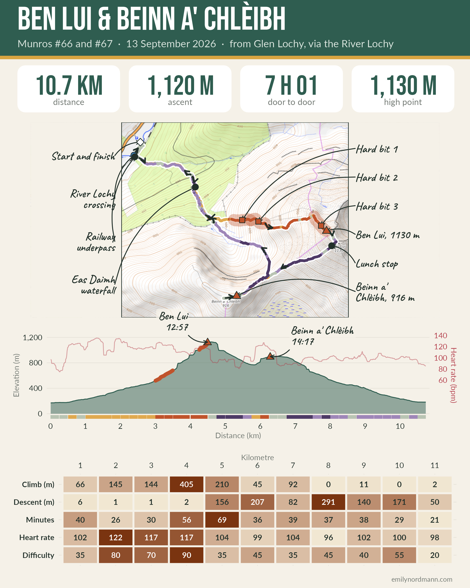

*This blog was written using Claude Fable 5.1 with the data from my Garmin, and then edited by me.*


## The short version

{fig-alt="Infographic for the Ben Lui and Beinn a' Chlèibh walk: headline stats (distance, ascent, total time and high point), a route map on OpenTopoMap tiles with the track coloured by gradient, direction arrows, labelled features in the margins and the three hardest sections marked, an elevation profile with heart rate, and a kilometre-by-kilometre difficulty strip."}

```{r setup}
library(tidyverse)
library(flextable)
source("../_munro-toolkit.R")

# The two hills, heights from the Database of British and Irish Hills
summits <- tribble(
  ~name,               ~height, ~lat,     ~lon,
  "Ben Lui",           1130,    56.3977, -4.8114,
  "Beinn a' Chlèibh",   916,    56.3902, -4.8355
)

# Watch data, decoded from the .fit file in data/ (see the notes at the end).
# The barometric altimeter read 1153 m on Ben Lui (map: 1130 m), so the
# whole profile is shifted down 23 m to put the high point at 1130 m.
track   <- munro_read_track("data/track.csv", calibrate_to = 1130)
segs    <- munro_segments(track, width = 250)
hard    <- munro_hard(segs, n = 3)
reached <- munro_summits(track, summits)
stats   <- munro_stats(track, tibble())

# Phone photos have a timestamp but no GPS, so each one is placed on the
# track at the point nearest the time it was taken
photos  <- munro_photos("photos.csv", tr = track)

# The walk in six stages, by distance along the route (km)
stages <- tribble(
  ~stage, ~name,                              ~from, ~to,
  1, "The river and the forest track",         0.0,  1.6,
  2, "Eas Daimh and Fionn Choirein",           1.6,  3.0,
  3, "The north-west ridge",                   3.0,  4.6,
  4, "Ben Lui: summit and macaroni pie",       4.6,  5.0,
  5, "Over to Beinn a' Chlèibh",               5.0,  6.5,
  6, "Down, through the forest, and wet again", 6.5, 10.8
) |>
  munro_stages(tr = track, segs = segs)

# Features to label in the map margins (in addition to the summits, start
# and hard bits, which are added automatically)
features <- tribble(
  ~label,                          ~lat,     ~lon,     ~kind,
  "River Lochy crossing",   56.4078, -4.8560, "river",
  "Eas Daimh waterfall",    56.4039, -4.8424, "note",
  "Lunch stop",             56.3967, -4.8122, "note",
  "Railway underpass",      56.4076, -4.8558, "note"
)
```

## The walk

These have been on our radar for a while but they involve a feet-wet river crossing, which had been putting us off but we finally took the literal plunge. As with anything, prior preparation prevents piss-poor performance, and with a spare pair of walking sandals and a towel we waded across the River Lochy. The walk is quite boggy, but it is mostly all avoidable with a detour into the forest. There was also a short scrambly bit I wasn't expecting near the summit of Ben Leui but it turned out to score low on the Nordmann Fear of Heights Spicy Chilli Pepper Scale (in prep), so no drama.

Here is the whole thing in one map. On the map the track is coloured by how steep the ground was at that point, the arrows are the direction of travel, the red sections are where the data think it was hardest, and the small blue numbers are where the photos were taken. 

```{r map}
#| fig-width: 12
#| fig-height: 8
#| fig-alt: "Route map on OpenTopoMap tiles. The GPS track is coloured by gradient from purple (steep descent) through grey to red (steep ascent), with direction arrows. Features are labelled in the margins either side of the map with leader lines: start and finish in Glen Lochy, the River Lochy crossing, the Eas Daimh waterfall, the two summits, the lunch stop, the three hardest sections and the railway underpass. Blue numbers mark where the photos were taken."

route_map <- munro_map(track, reached, photos = photos, hard = hard,
                       features = features, zoom = 14)
route_map
```

```{r stage-fn}
#| include: false
# Helper used by each stage section: the stats line under the heading
stage_intro <- function(i) {
  st <- stages |> filter(stage == i)
  cat(sprintf("**%s**\n\n", munro_stage_line(st)))
}
```

## Where it was hard

The profile of the whole day (the stages below zoom in on each part): height above sea level with the ground coloured underneath by gradient, my heart rate in red on the right-hand axis, the summit arrival times and the photo numbers. The three hardest 250 m sections are drawn as a thick rust stroke along the ground.

```{r profile}
#| fig-width: 11
#| fig-height: 5.5
#| fig-alt: "Elevation profile of the walk. The ground rises from about 200 m to Ben Lui at 1130 m by 4.6 km, drops to a bealach, climbs to Beinn a' Chlèibh at 916 m around 6.5 km and descends back to the start at 10.7 km. A coloured strip under the axis shows gradient, a red line shows heart rate, blue numbers mark photos, and the three hardest sections on the ridge of Ben Lui are drawn as a thick rust stroke."

# Hand-drawn labels: dx km along and dy m above the ground at dist
profile_callouts <- tribble(
  ~label,                ~dist, ~dy,  ~dx,
  "River crossing",       0.12,  260,  0.3,
  "Eas Daimh waterfall",  1.74,  220,  0.3,
  "Scramble",             4.35,  120,  -0.6,
  "Lunch stop",           4.78,  -80,  0.7,
  "Brownie stop",         6.47,  -90,  0.6
)

profile <- munro_profile(track, segs, summits = reached, hard = hard,
                         callouts = profile_callouts, photos = photos,
                         hard_labels = FALSE)
profile
```

"Hard" here is a blunt instrument. Each 250 m of the route gets a percentile rank within this walk for two things: how steep it was and my heart rate. Difficulty is the average of the two, scaled to 0 to 100, so 100 would be the stretch that was both the steepest and the highest heart rate of the whole day, and 0 the flattest and calmest. It is not a percentage of anything. That means it can only ever tell you which bits of *this* walk were hardest relative to the rest of *this* walk.

```{r hard-table}
hard |>
  transmute(
    `Hard bit`  = hard,
    `From (km)` = round(start, 2),
    `To (km)`   = round(end, 2),
    `Time`      = format(time_start, "%H:%M"),
    `Gradient`  = paste0(round(gradient), "%"),
    `Climbed`   = paste0(round(gain), " m"),
    `Avg HR`    = round(hr),
    `Difficulty` = round(difficulty * 100)
  ) |>
  flextable() |>
  autofit() |>
  theme_vanilla()
```

This graphic is the same idea kilometre by kilometre. Darker is harder (or higher, or longer) relative to the rest of the walk; difficulty is on the same 0 to 100 scale.

```{r strip}
#| fig-width: 11
#| fig-height: 4
#| fig-alt: "Heat-map strip with one column per kilometre and rows for metres climbed, metres descended, minutes taken, heart rate and the combined difficulty score. Kilometres 4 and 5 on the ascent of Ben Lui are darkest."

munro_strip(track)
```

And by stage:

```{r stage-table}
stages |>
  transmute(
    Stage = paste0(stage, ". ", name),
    `Km` = round(km, 1),
    `Up (m)` = round(gain),
    `Down (m)` = round(loss),
    `Time` = map_chr(mins * 60, munro_hm),
    `Avg HR` = round(avg_hr),
    `Difficulty` = round(difficulty * 100)
  ) |>
  flextable() |>
  autofit() |>
  theme_vanilla()
```

## Stage by stage

### 1. The river and the forest track

```{r stage1-line}
#| results: asis
#| echo: false
stage_intro(1)
```

```{r stage1-map}
#| fig-width: 9
#| fig-height: 5.5
#| echo: false
#| fig-alt: "Zoomed map of stage 1 on OpenTopoMap tiles: the whole route as a faint dashed line, this stage coloured by gradient with direction arrows, its photo numbers in blue, and features labelled in the margins with hand-drawn arrows."
munro_stage_map(track, 0, 1.6, photos = photos,
                summits = reached, features = features)
```

Straight out of the car park and into the River Lochy. Each stage below starts with a zoomed-in map of that section: the rest of the route is the faint dashed line. On the way out it was about knee high. I really wouldn't like to do these if the water was any higher: there are several burn crossings as well as the river, and the amount of water was impressive despite the river being in the middle-to-low part of its normal range. Then under the railway (the two underpass photos were taken on the way back, but this is where they belong) and up the forestry track beside the Eas Daimh, which is a long way from being a quiet burn.

```{r stage1-photos}
#| results: asis
#| echo: false
munro_stage_gallery(photos, 0, 1.6)
```

### 2. Eas Daimh and Fionn Choirein

```{r stage2-line}
#| results: asis
#| echo: false
stage_intro(2)
```

```{r stage2-map}
#| fig-width: 9
#| fig-height: 5.5
#| echo: false
#| fig-alt: "Zoomed map of stage 2 on OpenTopoMap tiles: the whole route as a faint dashed line, this stage coloured by gradient with direction arrows, its photo numbers in blue, and features labelled in the margins with hand-drawn arrows."
munro_stage_map(track, 1.6, 3.0, photos = photos,
                summits = reached, features = features)
```

The path leaves the forest at the big waterfall, where we had the first proper break, and then climbs steadily up the corrie towards the foot of the ridge. Nothing steep yet, which the heart rate agrees with, but wet underfoot and the boggy bits are where the forest adventure came in.

```{r stage2-photos}
#| results: asis
#| echo: false
munro_stage_gallery(photos, 1.6, 3.0)
```

### 3. The north-west ridge

```{r stage3-line}
#| results: asis
#| echo: false
stage_intro(3)
```

```{r stage3-map}
#| fig-width: 9
#| fig-height: 5.5
#| echo: false
#| fig-alt: "Zoomed map of stage 3 on OpenTopoMap tiles: the whole route as a faint dashed line, this stage coloured by gradient with direction arrows, its photo numbers in blue, and features labelled in the margins with hand-drawn arrows."
munro_stage_map(track, 3.0, 4.6, photos = photos,
                summits = reached, features = features)
```

All three of the "hard bits" the data picked out sit here: the gradient goes from 30% to around 50% (one metre up for every two along) and stays there for most of a kilometre. We climbed roughly 600 m in 1.6 km, with the cloud coming down to meet us, and the short scrambly bit is somewhere near the top. 

```{r stage3-photos}
#| results: asis
#| echo: false
munro_stage_gallery(photos, 3.0, 4.6)
```

### 4. Ben Lui: summit and macaroni pie

```{r stage4-line}
#| results: asis
#| echo: false
stage_intro(4)
```

```{r stage4-map}
#| fig-width: 9
#| fig-height: 5.5
#| echo: false
#| fig-alt: "Zoomed map of stage 4 on OpenTopoMap tiles: the whole route as a faint dashed line, this stage coloured by gradient with direction arrows, its photo numbers in blue, and features labelled in the margins with hand-drawn arrows."
munro_stage_map(track, 4.6, 5.0, photos = photos,
                summits = reached, features = features)
```

Summit at `r format(reached$time[1], "%H:%M")`, `r round(reached$elapsed[1], 1)` hours after leaving the car. A few minutes on top in the cloud, then lunch just below it on the sheltered side. Summit snack 1: macaroni pie. 

```{r stage4-photos}
#| results: asis
#| echo: false
munro_stage_gallery(photos, 4.6, 5.0)
```

### 5. Over to Beinn a' Chlèibh

```{r stage5-line}
#| results: asis
#| echo: false
stage_intro(5)
```

```{r stage5-map}
#| fig-width: 9
#| fig-height: 5.5
#| echo: false
#| fig-alt: "Zoomed map of stage 5 on OpenTopoMap tiles: the whole route as a faint dashed line, this stage coloured by gradient with direction arrows, its photo numbers in blue, and features labelled in the margins with hand-drawn arrows."
munro_stage_map(track, 5.0, 6.5, photos = photos,
                summits = reached, features = features)
```

Steeply down to the bealach, losing about 340 m, then 120 m back up to Beinn a' Chlèibh. Summit at `r format(reached$time[2], "%H:%M")`, and a salted caramel chocolate brownie. The cloud lifted while we were on it, so Ben Lui finally showed itself.

```{r stage5-photos}
#| results: asis
#| echo: false
munro_stage_gallery(photos, 5.0, 6.5)
```

### 6. Down, through the forest, and wet again

```{r stage6-line}
#| results: asis
#| echo: false
stage_intro(6)
```

```{r stage6-map}
#| fig-width: 9
#| fig-height: 5.5
#| echo: false
#| fig-alt: "Zoomed map of stage 6 on OpenTopoMap tiles: the whole route as a faint dashed line, this stage coloured by gradient with direction arrows, its photo numbers in blue, and features labelled in the margins with hand-drawn arrows."
munro_stage_map(track, 6.5, 10.8, photos = photos,
                summits = reached, features = features)
```

Back to the bealach and down Fionn Choirein rather than the ridge, which is steep, wet and grassy and takes longer than the map suggests. Then the forest (fly agaric season, and the forest adventure that keeps you out of the bog), the railway underpass and the river again. We found a shallower crossing on the return that was merely calf height on hobbits.

```{r stage6-photos}
#| results: asis
#| echo: false
munro_stage_gallery(photos, 6.5, 10.8)
```


```{r poster}
#| include: false

## The poster The infographic at the top is the map, the profile and the kilometre strip drawn again with less chrome, on a 1080 by 1350 canvas so it can go straight onto social media.


poster_map <- munro_map(track, reached, hard = hard, features = features,
                        zoom = 14, base_size = 16, label_size = 4.6) +
  theme(legend.position = "none", plot.caption = element_blank())

poster_profile <- munro_profile(track, segs, summits = reached, hard = hard,
                                show_hr = TRUE, base_size = 16, label_size = 4.6,
                                hard_labels = FALSE) +
  theme(legend.position = "none")

poster_strip <- munro_strip(track, fixed = FALSE, caption = FALSE, base_size = 16,
                            text_size = 4.6)

munro_poster(
  title    = "Ben Lui & Beinn a' Chlèibh",
  subtitle = "Munros #66 and #67  ·  13 September 2026  ·  from Glen Lochy, via the River Lochy",
  stats    = stats,
  map      = poster_map,
  profile  = poster_profile,
  strip    = poster_strip,
  file     = "ben-lui-infographic.png"
)
```

## Notes on the data

The watch exports a `.fit` file. There is no CRAN package I trust to read it on Windows, so a small Python script (`post/_fit2csv.py`) decodes it to a CSV with one row per second: time, position, barometric altitude, distance, the watch's own speed estimate, heart rate and cadence. Everything else is derived in R:

- **Altitude.** The watch measures height with a barometer, which drifts with the weather. On the summit of Ben Lui it read 1,153 m; the map says 1,130 m. The whole profile is shifted down by that 23 m so the high point matches the map. The ascent total is unaffected because it only depends on differences. Altitude is also smoothed with a running median to take the jitter out before ascent is summed, which is why the total here differs a little from Garmin's own 1,093 m (Garmin applies its own, undocumented, smoothing).
- **Gradient.** Change in height over 100 m of distance, so a 50% gradient is 50 m up for every 100 m along.
- **Photos.** The phone does not write GPS coordinates into the photos, but it does write the time, so each photo is put on the track at the point nearest to when it was taken. Two photos taken in the same spot get two markers on top of each other, which is why the numbers are nudged apart.
- **Difficulty.** The mean of the within-walk percentile ranks of absolute gradient and heart rate for each 250 m segment. It is relative, blunt and does not know about rivers.
- **Stages.** Split by distance along the route to match the story rather than anything in the data.

